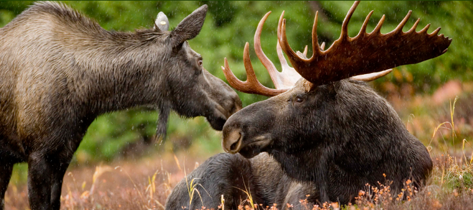

```{r, echo=FALSE, message=FALSE, warning=FALSE}
library(readxl)
library(readr)
library(lessR)
library(ggplot2)
library(patchwork)
library(palmerpenguins)
library(car)
library(ggforce) # for geom_circle
library(RVAideMemoire) #shapiro.test
library(DiagrammeR)
knitr::opts_chunk$set(dpi= 300)
xaringanExtra::use_panelset()
xaringanExtra::use_scribble()
xaringanExtra::use_search(show_icon = FALSE, position= "bottom-left") # Search
xaringanExtra::use_progress_bar(color = "#0051BA", location = "bottom", 
                                height = "4px")
xaringanExtra::use_clipboard() # Copy Code 
xaringanExtra::use_extra_styles(
  hover_code_line = TRUE,         #<<
  mute_unhighlighted_code = TRUE  #<<
)
xaringanExtra::use_editable(expires = 1) # Add textboxes to edit during presentation
```

# Statistics: What it is?

- **Statistics** describes a set of tools and techniques that are used for describing, organizing, and interpreting data.


- Without the use of statistics, we muddle through life making choices based on incomplete 
information.

---
# Why study statistics?

- Data are everywhere. 

- No matter what your career, you will make professional decisions that involve data. An understanding of statistical methods will help you make these decisions efectively.

---
# What is statistics used for?

- At a basic level, statistical techniques allow us to aggregate and summarize data in order for researchers to draw conclusions from their study

- Data, or observations, are collected in a very systematic manner, and conclusions are drawn based on the data.

---
# Thinking like a statistician

---
# Thinking like a statistician

- Becoming Bilingual:
    - To think like a statistician, you need to understand key terms that will help us communicate effectively throughout the semester. 
    
---
# Thinking like a statistician

- **Population:**
    - The collection of all elements or items of interest in a particular study.
    - It's the entire group about which we wish to draw conclusions.

--

- **Sample:**
    - A subset of measurements taken from a population, denoted as _n_.
    - Random Sample: A sample drawn in such a way that all observations have an equal chance of being selected.
      - Important: Ensure your sample represents the full range of characteristics present in your population.

--

- **Data Is Created, Not Found!**
    - Data doesn't simply exist, we generate it systematically through observations and measurements.

---
# Thinking like a statistician

- **Observation:**
    - A recording of specific information from a sample unit, denoted as _X_.
    - Observations may also be referred to as:
      - Samples
      - Measurements
      - Values
      - or simply _n_.

---
# Thinking like a statistician

- **Independence:** selection of any one sample unit (observations) does not affect the chances of any other unit being selected.
    - Variables can also be independent (co-vary in an unrelated pattern).

--

- **Replicate:** If measurements are in some way related, they must be treated as replicates and nested within the analysis such that sample size reflects the number of independent observations.
  - One simple way to work with replicates is to simply average them for each unit of observation.

---
# Thinking like a statistician
- Each **tank** is a replicate, but within each tank each trout is not independent. 
    - A replicate is **the smallest experimental unit to which a treatment is independently applied.**
  - Most models for statistical inference require true replication.
    - True replication permits the estimation of variability within a treatment.

<br>

.center[]

---
# Thinking like a statistician

.pull-left[

1. The simplest and most common type of pseudo-replication occurs when there is only one replicate per treatment. 

2. Sacrificial pseudo-replication occurs when data from true replicates are combined before analysis, removing their independence and potentially leading to inaccurate results.

3. Temporal pseudo-replication is also common in ecological experiments in which a time series of data are accumulated.

] 
.pull-right[

.center[

]
]


---
# Thinking like a statistician

- **Variable:** a quantity counted or measured the characteristic that is being observed. 

  1. Quantitative Variables
  2. Qualitative Variables

---
# Thinking like a statistician

.pull-left[
- **Quantitative Variables:** a measurable **amount**.
    1. **Continuous variable:**  may assume any imaginable value within a certain range. Can (theoretically) have an infinite number of values.
      - Weights, Heights

    2. **Discrete Variables:**  countable as integers (whole numbers). No values between two adjacent values are permissible.
      - Number of bicycles sold in a day.

] 
.pull-right[

.center[

```{r, echo=FALSE}
mermaid("graph TB
    A[Quantitative data] --> |measuring| Continuous
    A[Quantitative data] --> |counting| Discrete",

height = '100%', width = '100%')
```
]
]

---
# Thinking like a statistician

- **Qualitative Variables:** descriptive characteristic assignable to a category.
    1. **Nominal Variables**: measurements fall into a particular class or category with no order implied.
        - sex (male or female), color (red, blue, green).

    2. **Ordinal Variables:** a ranking scale where order between categories is implied.
        - Likert scale (strongly agree, agree, neutral, disagree, strongly disagree).  

    3. **Interval (ratio) Variables:** use a quantitative measurement to assign a specific qualitative category (these are still ordinal).
        - Temperature (cold, warm, hot), age (young, middle-aged, old).

---
# Thinking like a statistician

- **Independent:**  measurable variables whose value is not dependent upon other measured variables: aka **input variables**.   

- **Dependent:**  variable you want to predict.  The outcome of interest: aka **the response variable**
    - We hypothesize that its value is dependent on the value of the other measured variables.

---
# Thinking like a statistician

- You will find that there are other terms commonly used to refer to variables:
    - Independent Variables can be called:
        - Factor
        - Treatment 
        - Level
        - X 
        - Input

    - Dependent Variables can be called: 
        - Response
        - Y
        - Outcome

---
# Different types of statistics 

.center[
```{r, echo=FALSE}
mermaid("graph TB
    A[Statistics] --> B[Descriptive Statistics]
    A --> C[Inferential Statistics]
    B --> D[Summarizing Data]
    B --> E[Visualization of Data]
    C --> F[Hypothesis Testing]
    C --> G[Estimation]
", height = '100%', width = '100%')
```
]

---
# Descriptive Statistics
- **Descriptive statistics** are statistics that quantitatively describe or summarize the data. 
    - The aim of descriptive statistics is to summarize a sample, rather than use the data to learn about the population.
    - Usually, information is displayed visually in tables or figures.


---
# Inferential Statistics
- Mathematical methods that use probability theory to infer the properties of a population from the analysis of a sample drawn from it. 

- Inferential statistics aim to make generalizations and predictions from the sample to the population.
    - Example: Quantifying the typical stocking levels for forests across Vermont based on FIA inventory data.
    - Allows us to test hypotheses.

---
# Why do we need inferential statistics?
- Large populations make investigating each member impractical and expensive.

- Easier and cheaper to take a sample and make estimates about the population from the sample.

---
# One big happy family
- Descriptive and inferential statistics are not mutually exclusive.

.pull-left[
- **Descriptive Statistics:**

- We measured the length of each fish in Shelburne Pond and found that the mean length was 15 inches, the standard deviation was 2 inches, the minimum length was 10 inches, and the maximum length was 20 inches.

]
.pull-right[ 
- **Inferential Statistics:**

- We measured the length of each fish in Shelburne Pond and then announced that we are 95% confident that the average length of all fish in the lake is between 14.5 and 15.5 inches.
]

---
# Terminology in action

.pull-left[
Moose herds across the Northeast are increasingly under stress from climate change. Specifically, wildlife biologists are concerned that warmer falls and early springs are increasing winter tick numbers that can have detrimental effects on moose.  They have tranquilized and sampled 59 moose from across the state of VT to see if the density (mean per sq. inch from 5 patches) of winter ticks is impacting moose vitality (measured as weight).

.center[

]
]

.pull-right[ 

- **Research Question:**
<div style="height: 45px; display: block;"></div>
- **Population:**
<div style="height: 45px; display: block;"></div>
- **Sample:**
<div style="height: 45px; display: block;"></div>
- **Observation:**
<div style="height: 45px; display: block;"></div>
- **Name and Describe the variables:** 
<div style="height: 45px; display: block;"></div>
- **Analysis Type:**
]


---
# Terminology in action

.pull-left[
Moose herds across the Northeast are increasingly under stress from climate change. Specifically, wildlife biologists are concerned that warmer falls and early springs are increasing winter tick numbers that can have detrimental effects on moose.  They have tranquilized and sampled 59 moose from across the state of VT to see if the density (mean per sq. inch from 5 patches) of winter ticks is impacting moose vitality (measured as weight).

.center[

]
]

.pull-right[ 

- **Research Question:**
Is winter tick density related to moose weight?

- **Population:**
All moose in VT

- **Sample:**
The 59 moose they were able to catch

- **Observation:**
A moose (the 5 patches on each moose are replicates)

- **Name and Describe the variables:** 
Dependent = Moose Weight (continuous)
Independent = Tick density (continuous)

- **Analysis Type:**
Inferential  -  Correlation

]


---
# Terminology in action

.pull-left[
The Vermont DEC is monitoring 12 sentinel streams in Vermont. These reference streams are widely variable in terms of development and agricultural density.  Scientists are using species richness of sensitive macroinvertebrates at three drift net locations along each stream as an indicator of overall water quality to see if the density of agriculture and development (categorized as minimal, mixed or moderate) within watersheds significantly impairs water quality.
.center[

]
]

.pull-right[ 

- **Research Question:**
<div style="height: 45px; display: block;"></div>
- **Population:**
<div style="height: 45px; display: block;"></div>
- **Sample:**
<div style="height: 45px; display: block;"></div>
- **Observation:**
<div style="height: 45px; display: block;"></div>
- **Name and Describe the variables:** 
<div style="height: 45px; display: block;"></div>
- **Analysis Type:**
]


---
# Terminology in action

.pull-left[
The Vermont DEC is monitoring 12 sentinel streams in Vermont. These reference streams are widely variable in terms of development and agricultural density.  Scientists are using species richness of sensitive macroinvertebrates at three drift net locations along each stream as an indicator of overall water quality to see if the density of agriculture and development (categorized as minimal, mixed or moderate) within watersheds significantly impairs water quality.
.center[

]
]

.pull-right[ 

- **Research Question:**
Does the density of agriculture and development impact macroinvertebrate species richness?

- **Population:**
All streams in VT

- **Sample:**
12 Sentinel streams in VT

- **Observation:**
A stream (drift net replicates at each stream)

- **Name and Describe the variables:** 
Dependent: species richness (continuous)
Independent: Ag density (ordinal), Dev density (ordinal)

- **Analysis Type:**
Inferential: Factorial ANOVA

]

