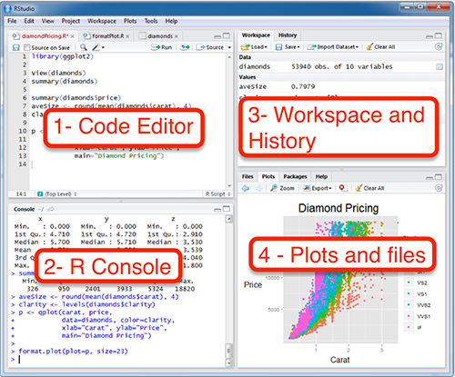
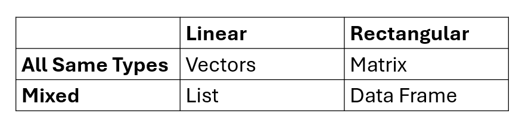

## What is R Programming?
- R is a free and open source software environment and programming language for statistics.

<br>

- R was created by Ross Ihaka and Robert Gentleman at the University
of Auckland (in New Zealand), and is based on the S language that
was created by John Chambers at Bell Laboratories.
<br>
```{r, echo=FALSE, fig.cap="", out.width = '50%'}
knitr::include_graphics("fig/criadores_r.png")
```


## What is R Programming?
- When you download and install R, you get a collection of basic packages (and libraries) that can be used to implement several common data manipulations, graphical displays, and statistical models.
<br>
```{r, echo=FALSE, fig.cap="", out.width = '30%'}
knitr::include_graphics("fig/meme.jpg")
```


## Strengths and Weaknesses
* **Strengths:**  
-Free and Open Source.  
-Strong User Community.  
-Highly extensible, flexible.  
-Implementation of high-end statistical methods.  
-Flexible graphics and intelligent defaults.  

<br>

* **Weakness:**  
-Steep learning curve.  
-Slow for large datasets.  


## Why R?
- **Computing power**: R can handle much larger datasets than traditional programs, which is especially important for long-term ecological data, community science data, and public health data.

<br>

- **Flexibility & convenience**: Traditionally, scientists would need separate programs for data cleaning, statistical procedures, and data visualization.  
Learning R means you can do everything in a single program, and
customize to fit the goals of your project.

<br>

- **Reproducibility**: Saving your code as an R script makes it easy for other scientists to see what you did, and repeat your methods.


## R Overview


## How to download?
- Google it using R or CRAN (Comprehensive R Archive Network)  
-- http://www.r-project.org


## How to download?
- Having installed R, the next thing we will want to do is install **RStudio**, a popular and useful interface for writing scripts and using R.

<br>

- If you google **RStudio** you will get to this window:  
https://www.rstudio.com/products/rstudio/download/ 

<br>

- Rstudio is an ***integrated development environment (IDE)*** for R that allows users to interact more easily with R by integrating different aspects of scripting, from code completion to debugging.


##  Typical Rstudio session
- **Code Editor**: Contains code to tell R what to do.  Save scripts for future use
<br>
```{r, echo=FALSE, fig.cap="", out.width = '50%'}

```


##  Typical Rstudio session
- **Console**: output & temporary input - usually unsaved
<br>
```{r, echo=FALSE, fig.cap="", out.width = '50%'}

```


##  Typical Rstudio session
- **Workspace**: Stores objects created during the session.  Save with save.image().
- **History**: Records commands used.  Save with savehistory().
<br>

```{r, echo=FALSE, fig.cap="", out.width = '50%'}

```

##  Typical Rstudio session
- **Plots**: Displays graphs.  Save plots with ggsave().
- **Files**: Shows files in the working directory.

<br>

```{r pressure, echo=FALSE, fig.cap="", out.width = '50%'}

```

## Data structures

## Data structures
- R is an object oriented programming language where an **object** is a generic term to describe something in R.

<br>

- There are many types of R-objects.  
Vectors  
Factors  
Lists  
Matrices  
Data Frames  


## Vectors in R
- Vector is a sequence of elements of the same type (numeric, character, logical).
```{r}
a <- c(1,2,3,4,5)
b <- c(6,7,8,9,10)
```
- Command *c* creates a vector that is assigned to object a and b


## Vectors in R
- Two vectors of the same lenght can be addedd (a+a), multiply (a*a)
```{r}
c <- (a+b)
c

d <- (a*b)
d
```


## Vectors in R
- Element in a vector can be sorter (*sort()*)
```{r}
e <- c(3,2,20,25,5)
sort(e)
```

## Factors in R
- Categorical data structure with predefined levels.
```{r}
f <- factor(c("low", 'medium', "high", 'very high'))
```

## Data
- R has three general classes for data:  

  1. **list**: collection of objects of different lengths or classes 
  2. **matrix**: vectors of the same length and same class
  3. **data.frame**: vectors of the same length and different classes

## Lists 
- A list is an R-object which can contain many different types of elements inside it like vectors, functions and even another list inside it.
```{r, echo=TRUE}
# Creating a list in R with various types of elements
my_list <- list(
  # A numeric vector
  Numbers = c(1, 2, 3, 4, 5),
  # A character vector
  Words = c("apple", "banana", "cherry"))
```

## Lists 
- A list is an R-object which can contain many different types of elements inside it like vectors, functions and even another list inside it.
```{r, echo=TRUE}
  NestedList = list(
    Logical = c(TRUE, FALSE, TRUE),
    Mixed = c(3.14, "pi", FALSE))
NestedList
```


## Matrices 
- A matrix is a two-dimensional rectangular data set. 
- It can be created using a vector input to the matrix function. 
```{r, echo=TRUE}
# Create a 3x3 matrix in R
my_matrix <- matrix(
  data = 1:9,       # Data to fill the matrix
  nrow = 3,         # Number of rows
  ncol = 3,         # Number of columns
  byrow = TRUE)      # Fill the matrix by rows
my_matrix
```


## Data Frames 
- Data frames are tabular data objects. 
- **Unlike a matrix in data frame each column can contain different modes of data.** 

<br>

- The first column can be numeric while the second column can be character and third column - Can be logical. 

<br>

- It is a list of vectors of equal length. 

<br>

- Data Frames are created using the ***data.frame()*** function. 

<br>

- When we execute the above code, it produces the following result:


## Table
- Summary
```{r, echo=FALSE, fig.cap="", out.width = '80%'}

```

 
## Reading data
## Reading data
- Command for reading in text files is:
```{r eval=FALSE}
read.table("suomi.txt", header=T, sep="\t")
```

- This examples has one command with three arguments: 
  - file name (in quotes)
  - header that tells whether columns have titles
  - sep that tells that the file is tab-delimited.

## Reading data
- **CSV File**
 - Usage: Reads comma-separated values, often used for structured data.
```{r eval=FALSE}
data <- read.csv("file.csv")
```

- **Text File**  
 - Usage: Reads tabular data from a text file; sep can be adjusted for different delimiters.
```{r eval=FALSE}
data <- read.table("file.txt", header = TRUE, sep = "\t")

```

- **Excel File**
 - Usage: Reads data from Excel files; you can specify the sheet number or name.
```{r eval=FALSE}
library(readxl)
data <- read_excel("file.xlsx", sheet = 1)
```


## Reading data
- Print the current working directory
```{r, eval=FALSE}
getwd()
```

- Change to my directory
```{r, eval=FALSE}
setwd(mydirectory)
setwd("c:/docs/mydir") 
```

## Reading data
- Subscripts are given inside square brackets after the object's name:
- df[,1]
  - Gets the **first column** from the object dat

- df[,1]
  - Gets the **first row** from the object dat

- df[1,1]
  - Gets the **first row** and it's **first column** from the object dat

## Reading data
- Subscripts can be used for, e.g., extracting a subset of the data:
  - df[which(df$year>1900),]
    - Now, this takes a bit of pondering to work out.
    - First we have the object df, and we are accessing a part of it, because it's name is followed by the square brackets

    - Then we have one command (which) that makes an evaluation whether the column year in the object df has a value higher than 1900.

    - Last the subscript ends with a comma, that tells us that we are accessing rows.

    - So this command takes all the rows that have a year higher 1900 from the object dat that is a data frame.


## Assigning Values in R
- In R, you can assign values to objects using the syntax object <- value
- An arrow (<-) formed by a smaller than character and a hyphen without a space!
- The equal character (=).


## R Warning!
- Naming objects:
    - R is a case sensitive language. 
    - FOO, Foo, and foo are three different objects 
    - Object names can't start with a number
    - Never use special characters, such as å, ä, or ö in object names.

## Using Functions in R
- R is a function based language where a ***function*** takes in some input and produces some output.
  - Vegas rules: what happens in a function, stays in a function.

## Data Visualization in R
- Most powerful approach to statistical graphs, based on the **Grammar of Graphics**.

<br>

- A graphics language, composed of layers, **geoms** (points, lines, regions), each with graphical **aesthetics** (color, size, shape)
```{r}
library(ggplot2)
library(palmerpenguins)
```


## An Introduction to ggplot2
```{r, fig.width=3.5, fig.height=1.5}
ggplot(data = penguins, aes(x = flipper_length_mm, 
                          y = body_mass_g)) +
    geom_point(aes(color = species, shape = species))

```


## An Introduction to ggplot2
```{r, eval= FALSE}
ggplot(data = <your data set>, aes(x = <x axis variable>, 
                                   y = <y axis variable>)) +
    geom_point(aes(size = <size variable>, 
                   color = <color variable>, 
                   shape = <shape variable>))
```

