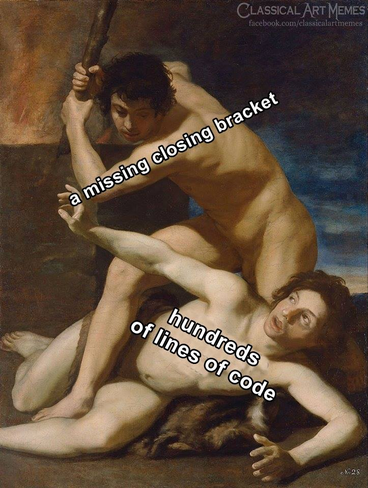

```{r, echo=FALSE, message=FALSE, warning=FALSE}
library(readxl)
library(readr)
library(lessR)
library(ggplot2)
library(patchwork)
library(palmerpenguins)
library(car)
library(ggforce) # for geom_circle
library(RVAideMemoire) #shapiro.test
library(DiagrammeR)
knitr::opts_chunk$set(dpi= 300)
xaringanExtra::use_panelset()
xaringanExtra::use_scribble()
xaringanExtra::use_search(show_icon = FALSE, position= "bottom-left") # Search
xaringanExtra::use_progress_bar(color = "#0051BA", location = "bottom", 
                                height = "4px")
xaringanExtra::use_clipboard() # Copy Code 
xaringanExtra::use_extra_styles(
  hover_code_line = TRUE,         #<<
  mute_unhighlighted_code = TRUE  #<<
)
xaringanExtra::use_editable(expires = 1) # Add textboxes to edit during presentation
```

# What is R Programming?
- R is a free and open source software environment and programming language for statistics.

- R was created by Ross Ihaka and Robert Gentleman at the University
of Auckland (in New Zealand), and is based on the S language that
was created by John Chambers at Bell Laboratories.

.center[
```{r, echo=FALSE, fig.cap="", out.width = '50%'}
knitr::include_graphics("fig/creadores_r.png")
```
]

---
# What is R Programming?
- When you download and install R, you get a collection of basic packages (and libraries) that can be used to implement several common data manipulations, graphical displays, and statistical models.
.center[
```{r, echo=FALSE, fig.cap="", out.width = '30%'}

```
]

---
# Strengths and Weaknesses
* **Strengths:**  
-Free and Open Source.  
-Strong User Community.  
-Highly extensible, flexible.  
-Implementation of high-end statistical methods.  
-Flexible graphics and intelligent defaults.  

--

* **Weakness:**  
-Steep learning curve.  
-Slow for large datasets. 


