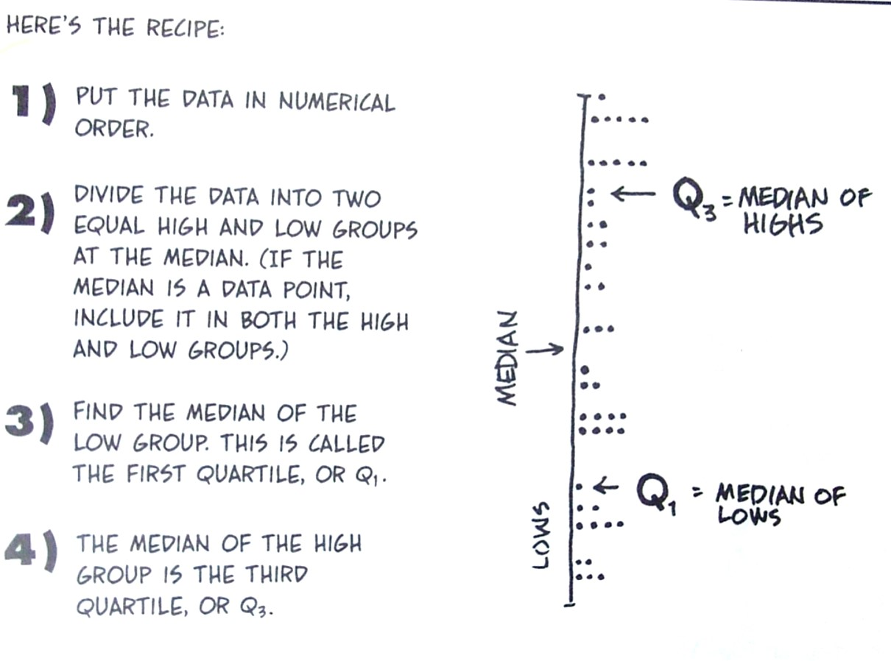
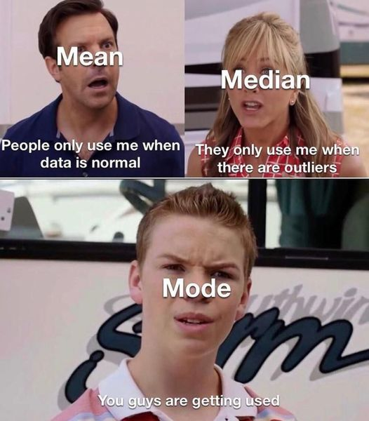

```{r, echo=FALSE, message=FALSE, warning=FALSE}
library(readxl)
library(readr)
library(lessR)
library(ggplot2)
library(patchwork)
library(palmerpenguins)
library(car)
library(ggforce) # for geom_circle
library(RVAideMemoire) #shapiro.test
library(DiagrammeR)
knitr::opts_chunk$set(dpi= 300)
xaringanExtra::use_panelset()
xaringanExtra::use_scribble()
xaringanExtra::use_search(show_icon = FALSE, position= "bottom-left") # Search
xaringanExtra::use_progress_bar(color = "#0051BA", location = "bottom", 
                                height = "4px")
xaringanExtra::use_clipboard() # Copy Code 
xaringanExtra::use_extra_styles(
  hover_code_line = TRUE,         #<<
  mute_unhighlighted_code = TRUE  #<<
)
xaringanExtra::use_editable(expires = 1) # Add textboxes to edit during presentation
```

# Why describe data?
- Determine if our sample reflects the population of interest.  

--

- Identify outliers.  

--

- Obtain metrics necessary for inferential tests.  

--

- Understand the distribution of our data values (i.e., test for normality).  

--

- Identify the type of statistical test to run.  

---

# Data description and visualization
- We can examine our data and run statistical tests to see if the distribution approximates a normal curve.  
- Typically, we start by visualizing our data.    


```{r echo=FALSE,warning=FALSE, fig.width=2.5, fig.height=1.5}
# Set parameters for the normal distribution
mean <- 0
sd <- 1
n <- 1000

# Generate data
data <- data.frame(x = rnorm(n, mean, sd))

# Create the plot
ggplot(data, aes(x = x)) +
  geom_density(fill = "lightblue", alpha = 0.5) +
  stat_function(fun = dnorm,
    args = list(mean = mean, sd = sd),
    color = "red",
    size = 1) + xlab("Value") + ylab("") +
  theme_minimal()
```

---
# Histogram basic
- Continuous data are most commonly visualized using Histograms. 

- Histograms display the distribution of data by grouping values into intervals or bins, allowing for an understanding of the frequency and spread of the data.

```{r, echo=FALSE, fig.cap="", out.width = '80%', fig.align='center'}
knitr::include_graphics("fig/Histogram.jpg")
```

---
# Box and Whisker Basics
- Box plots are used to visualize the distribution of continuous data, showing the **median**, **interquartile range (IQR)**, and **potential outliers**.

- The **box** represents the middle 50% of the data (from the first quartile \( Q1 \) to the third quartile \( Q3 \)).

- The **line inside the box** shows the median (50th percentile).

- **Whiskers** extend from the box to the smallest and largest values within 1.5 times the IQR from \( Q1 \) and \( Q3 \).
- **Data points outside the whiskers** are considered potential **outliers**.

```{r, echo=FALSE, fig.cap="", out.width = '50%', fig.align='center'}
knitr::include_graphics("fig/box.jpg")
```

---
# Metrics to Describe data distribution.

---
# Metrics to Describe data distribution.
- Data and their associated distributions can be described in four primary way:
  - Central Tendency (mean, median, mode)
  - Variability (standard deviation, variance, quantiles)
  - Skew
  - Kurtosis (Peakedness)

---
# Metrics to Describe data distribution.
- Data and their associated distributions can be described in four primary way:
  - **Central Tendency (mean, median, mode)**
  - Variability (standard deviation, variance, quantiles)
  - Skew
  - Kurtosis (Peakedness)

---
# Central tendency
- **Mean $\frac{\sum X}{n}$ **:
    - Most often used measure of central tendency.
    - Works well with normal and relatively normal curves.

--

- **Median (50th Percentile)**:
    - No formula.  Rank order observations then find the middle.
    - The second most used measure of central tendency.
    - Works best with highly skewed populations.
  
--
  
- **Mode (Most Frequent Score)**:
    - Least used measure of central tendency.
    - Works best for highly irregular and multimodal distributions. 
    
---
# Central tendency: Mean
$$ \bar{X} = \frac{\sum X}{n} $$
  - where ** $\bar{X}$ ** represents individual data points and ** $n$ ** is the number of observations.
  
--

- Sample mean is the measure of central tendency that best represents the population mean.

--

- Mean is **very** sensitive to extreme scores that can "skew" or distort findings.

---
# Central tendency: Median
- Percentiles are used to define the percent of cases equal to and below a certain point on a distribution.
  - The median **is the 50th percentile**, meaning *half of all observations fall at or below this value*.
  
- But lots of other percentiles are also important.

---
# A little about Percentiles

.pull-left[
- Quartiles (i.e., divide data into four equal parts: 25%, 50%, 75%) are a common percentile used to represent the value below  which. 
  - 25% (Q1 or first quartile)  
  - 75% (Q3 or third quartile)  

] 
.pull-right[
```{r, echo=FALSE, fig.cap="", out.width = '100%'}

```
]         

---
# When to use What
.pull-left[

- Use the **Mode** when the data are categorical:
  - **Mode**: is the value that occurs most frequently in your data.  
  - This is because having the same value occur for measurements with many significant digits is highly unlikely.


- Use the **Median** when you have extreme scores:  
  - **Median**: is simply the value that falls in the middle of all your data. 

- Use the **Mean** the rest of the time. 

] 
.pull-right[
```{r, echo=FALSE, fig.cap="", out.width = '60%'}

```
]

---
# Metrics to Describe data distribution.
- Data and their associated distributions can be described in four primary way:
  - Central Tendency (mean, median, mode)
  - **Variability (standard deviation, variance, quantiles)**
  - Skew
  - Kurtosis (Peakedness)
  
---
# Variability
.center[
```{r, echo=FALSE, fig.cap="", out.width = '80%'}
knitr::include_graphics("fig/variability.png")
```
]

---
# Variability: Standard Deviation
- **Standard Deviation** measures how spread out the numbers in a dataset are around the mean.

- The sample standard deviation \( s \) is calculated as:
```{r echo=FALSE, results='asis'}
cat("$$s = \\sqrt{\\frac{\\sum (x_i - \\bar{x})^2}{n - 1}}$$")
``` 

  - \( s \): The **sample standard deviation**, which measures the spread or variability of the data points around the sample mean \( \bar{x} \).
  - \( n \): The **sample size**, or the number of observations in the dataset.
  - \( x_i \): Each individual data point in the sample.
  - \( \bar{x} \): The **sample mean**, or the average of the sample data.

