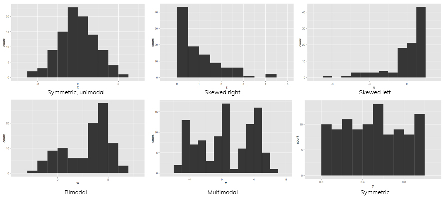
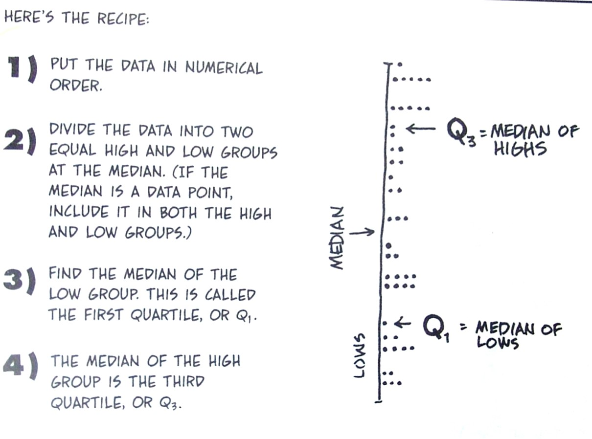
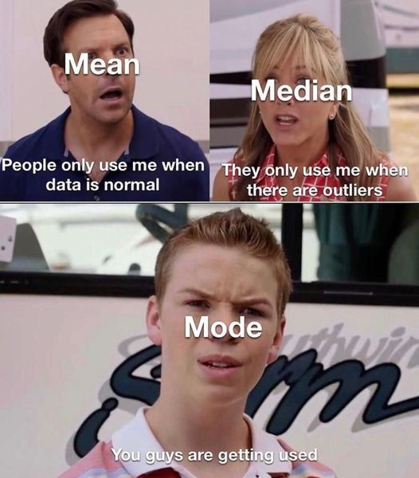
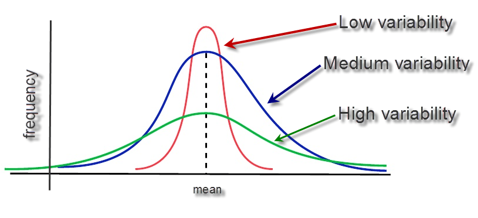
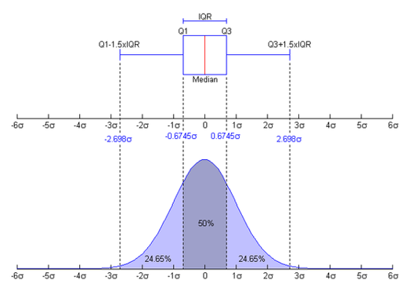
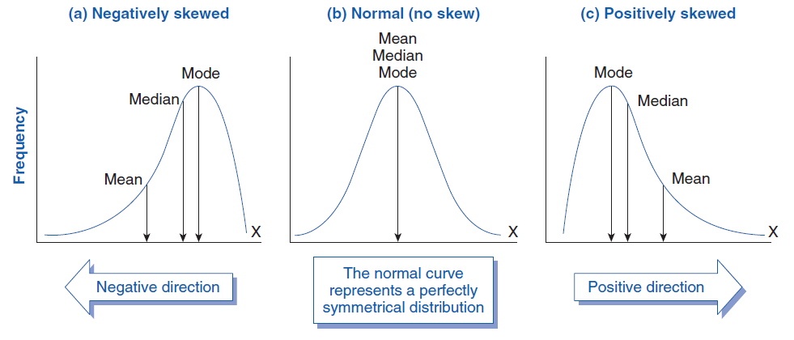
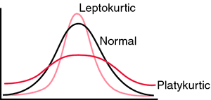
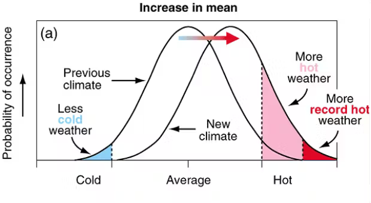
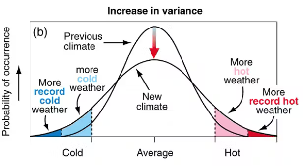
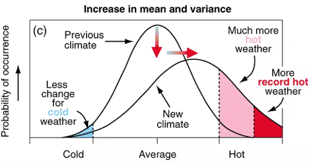

## Why describe data?
- Determine if our sample reflects the population of interest.  

<br>

- Identify outliers.  

<br>

- Obtain metrics necessary for inferential tests.  

<br>

- Understand the distribution of our data values (i.e., test for normality).  

<br>

- Identify the type of statistical test to run.  


## Data description and visualization
- We can examine our data and run statistical tests to see if the distribution approximates a normal curve.  
- Typically, we start by visualizing our data.    


```{r echo=FALSE,warning=FALSE, fig.width=3.5, fig.height=2.2}
# Load necessary libraries
library(ggplot2)

# Set parameters for the normal distribution
mean <- 0
sd <- 1
n <- 1000

# Generate data
data <- data.frame(x = rnorm(n, mean, sd))

# Create the plot
ggplot(data, aes(x = x)) +
  geom_density(fill = "lightblue", alpha = 0.5) +
  stat_function(
    fun = dnorm,
    args = list(mean = mean, sd = sd),
    color = "red",
    size = 1
  ) +
  xlab("Value") +
  ylab("") +
  theme_minimal()
```


## Histogram basic
- Continuous data are most commonly visualized using Histograms. 

<br>

```{r, echo=FALSE, fig.cap="", out.width = '80%', fig.align='center'}

```

## Box and Whisker Basics
- Box plots are used to visualize the distribution of continuous data, showing the **median**, **interquartile range (IQR)**, and **potential outliers**.
- The **box** represents the middle 50% of the data (from the first quartile \( Q1 \) to the third quartile \( Q3 \)).
- The **line inside the box** shows the median (50th percentile).
- **Whiskers** extend from the box to the smallest and largest values within 1.5 times the IQR from \( Q1 \) and \( Q3 \).
- **Data points outside the whiskers** are considered potential outliers.
  
<br>

```{r, echo=FALSE, fig.cap="", out.width = '60%', fig.align='center'}
knitr::include_graphics("fig/box.jpg")
```

## Metrics to Describe data distribution.
- Data and their associated distributions can be described in four primary way:

  - Central Tendency (mean, median, mode)
  - Variability (standard deviation, variance, quantiles)
  - Skew
  - Kurtosis (Peakedness)
  
## Metrics to Describe data distribution.
- Data and their associated distributions can be described in four primary way:

  - **Central Tendency (mean, median, mode)**
  - Variability (standard deviation, variance, quantiles)
  - Skew
  - Kurtosis (Peakedness)

## Central tendency
- **Mean \( \left( \frac{\sum X}{n} \right) \)**:
  - Most often used measure of central tendency.
  - Works well with normal and relatively normal curves.

<br>

- **Median (50th Percentile)**:
  - No formula.  Rank order observations then find the middle.
  - The second most used measure of central tendency.
  - Works best with highly skewed populations.
  
<br>
  
- **Mode (Most Frequent Score)**:
  - Least used measure of central tendency.
  - Works best for highly irregular and multimodal distributions. 


## Central tendency: Mean
- \( \left( \bar{X} = \frac{\sum X}{n} \right) \) <br>
  - where \( X \) represents individual data points and \( n \) is the number of observations.
  
<br>

- Sample mean is the measure of central tendency that best represents the population mean.

<br>

- Mean is **very** sensitive to extreme scores that can "skew" or distort findings.


## Central tendency: Median
- Percentiles are used to define the percent of cases equal to and below a certain point on a distribution.
  - The median **is the 50th percentile ** half of all observations fall at or below this value.
  
<br>

- But lots of other percentiles are also important.

## A little about Percentiles
- Quartiles are a common percentile used to represent the value below  which. 
  - 25% (Q1 or first quartile)  
  - 75% (Q3 or third quartile)  

```{r, echo=FALSE, fig.cap="", out.width = '40%'}

```
                     
## When to use What
- Use the **Mode** when the data are categorical:  
  - **Mode**: is the value that occurs most frequently in your data.  
  - This is because having the same value occur for measurements with many significant digits is highly unlikely.

<br>

- Use the **Median** when you have extreme scores:  
  - **Median**: is simply the value that falls in the middle of all your data. 

<br>

- Use the **Mean** the rest of the time. 

  
```{r, echo=FALSE, fig.cap="", out.width = '25%'}

```


## Metrics to Describe data distribution.
- Data and their associated distributions can be described in four primary way:

  - Central Tendency (mean, median, mode)
  - **Variability (standard deviation, variance, quantiles)**
  - Skew
  - Kurtosis (Peakedness)
  
## Variability
```{r, echo=FALSE, fig.cap="", out.width = '80%'}

```

## Variability: Standard Deviation
- Standard Deviation measures how spread out the numbers in a dataset are around the mean.

<br>

- The sample standard deviation \( s \) is calculated as:
```{r echo=FALSE, results='asis'}
cat("$$s = \\sqrt{\\frac{\\sum_{i=1}^{n} (x_i - \\bar{x})^2}{n - 1}}$$")
``` 


## Variability
- **Variance** measures the average of the squared differences from the mean, indicating how spread out the data points are.

<br>

- The variance \( \sigma^2 \) is calculated as:
```{r echo=FALSE, results='asis'}
cat("$$s^2 = \\frac{\\sum_{i=1}^{n} (x_i - \\bar{x})^2}{n - 1}$$")
```


## Variability: Range
- **Range** is the difference between the largest and smallest values in a dataset, providing a measure of the spread or dispersion of the data.

<br>

- The range is calculated as:
```{r echo=FALSE, results='asis'}
cat("$$\\text{Range} = \\text{max}(x) - \\text{min}(x)$$")
```

## Percentiles are useful for spread too
- You can use percentiles to get a feel for how spread out the data is and where most of your observations are contained:

  - Inter-quartile range (IQR) = Q3 - Q1  
  
```{r, echo=FALSE, fig.cap="", out.width = '60%'}

```


## Identifying outliers
- An outlier is an observation that lies outside the overall pattern of a distribution (Moore and McCabe 1999). 

<br>

- Usually, the presence of an outlier indicates some sort of problem. (e.g. an error in measurement or sample selection).

<br>

- But they may also be an indicator of novel data or identification of unique and exciting observations.

## Identifying outliers
- The first and third quantiles (Q1 and Q3) are often calculated to identify outliers. 

<br>

- One method for systematically identifying outliers uses:
  - Q1 - (1.5 * the inter-quartile range)
  - Q3 + (1.5 * the inter-quartile range)

<br>

- Others identify outliers as any values below the 0.5th or above the 99.5th percentile. 

## When to use What
- Use the **Standard deviation (SD)** in most cases.
  - SD quantifies how far, on average, each observation is from the mean. 
  - The larger the SD, the more highly variable your data.

<br>

- Use **range (R)** when describing predictive models. 
  - R is simply the maximum minus the minimum value in your data set
  - R is important when modeling or making predictions, since your algorithms are valid only over the range of values used to calibrate your predictive model

<br>

- Use the **IQR** to identify and test potential outliers in your data.


## Metrics to Describe data distribution.
- Data and their associated distributions can be described in four primary way:

  - Central Tendency (mean, median, mode)
  - Variability (standard deviation, variance, quantiles)
  - **Skew**
  - Kurtosis (Peakedness)

## Skewness
- Skewness: This metric quantifies how balanced (symmetrical) your 
distribution curve is.
  
```{r, echo=FALSE, fig.cap="", out.width = '80%'}

```

  
## Skewness
- A **normal distribution** will have its mean and median values located somewhere near the center of its range.
  
```{r, echo=FALSE, fig.cap="", out.width = '80%'}

```


## Skewness
- Skew of this peak away from center is common when extreme values pull the median away from the mean.
```{r, echo=FALSE, fig.cap="", out.width = '80%'}

library(png)
library(ggplot2)
library(grid)
# Load the image
img <- png::readPNG("fig/skewness.png")
grid::grid.raster(img)

# Add an arrow annotation (customize x and y coordinates as needed)
grid::grid.lines(x = c(0.5, 0.75), y = c(0.1, 0.25),  gp = gpar(col = "red"),
                 arrow = arrow(angle = 15, length = unit(0.3, "inches"), type = "closed"))

# Add an arrow annotation (customize x and y coordinates as needed)
grid::grid.lines(x = c(0.5, 0.25), y = c(0.1, 0.25), gp = gpar(col = "red"),
                 arrow = arrow(angle = 15, length = unit(0.3, "inches"), type = "closed"))
```


## Skewness
- **Positive Skew**: the "slide" takes you in a positive direction.  
  - The mean is bigger than the median (which is why the slide is being pulled to higher values).  

<br>

- **Negative Skew**: the "slide" takes you in a negative direction.  
  - The mean is smaller than the median (which is why the slide is being pulled to lower values).
  
```{r, echo=FALSE, fig.cap="", out.width = '80%'}

```

## Calculating Skew
- Negative value = Negative Skew.

<br>

- Positive value = Positive Skew

<br>

- Zero = Normal distribution

<br>

```{r echo=FALSE, results='asis'}
cat("$$\\text{Skewness} = \\frac{3(\\bar{x} - \\text{Median})}{\\text{SD}}$$")
```

- where:
  - \( \bar{x} \) is the **sample mean**, representing the average of all data points.
  - **Median** is the middle value in a dataset when sorted in ascending or descending order.
  - **SD** (Standard Deviation) measures the spread of the data points around the mean.
  
  
## Skewness: Significant?
- To determine if this deviation from zero in the skew statistic is likely a significant departure from normality, compare it to the **standard error of skew (ses)**.

- If the skew you have calculated is more than **2 times the ses**, then you likely have significant skew, which means you have **non normal data** and should consider a nonparametric test for your statistical analyses

```{r echo=FALSE, results='asis'}
cat("
$$
\\begin{array}{cc}
ses = \\sqrt{\\frac{6}{n}} & \\hspace{1cm} \\text{Skewness} = \\frac{3(\\bar{x} - \\text{Median})}{\\text{SD}}
\\end{array}
$$
")
```


## Metrics to Describe data distribution.
- Data and their associated distributions can be described in four primary way:

  - Central Tendency (mean, median, mode)
  - Variability (standard deviation, variance, quantiles)
  - Skew
  - **Kurtosis (Peakedness)**
  
## Kurtosis
- **Kurtosis** is simply a measure of how pointy or flat the peak of your distribution curve is.

<br>

- Any deviation from a bell shape, with the peak either too flat (platykurtic) or too peaked (leptokurtic), suggests that your data are not normally distributed.
  
```{r, echo=FALSE, fig.cap="", out.width = '60%'}

```


## Kurtosis
- Positive values = Leptokurtic.

<br>

- Zero  = Mesokurtic = normal (bell-shaped). 

<br>

- Negative values = Platykurtic.
```{r echo=FALSE, results='asis'}
cat("
$$
\\text{Kurtosis} = \\frac{\\sum(\\left( \\frac{x_i - \\bar{x}}{\\text{SD}} \\right)^4 - 3)}{n}
$$
")
```

- where:
  - \( x_i \) represents each individual data point.
  - \( \bar{x} \) is the **sample mean**, the average of all data points.
  - **SD** (Standard Deviation) is the measure of how spread out the data points are from the mean.
  - \( n \) is the number of data points in the sample.
  - The subtraction of 3 is to adjust for the kurtosis of a normal distribution, which has a kurtosis of 3.


## Kurtosis: Significant?
- To determine if this deviation from zero in the kurtosis statistic is likely a significant departure from normality, compare it to the **standard error of kurtosis (sek)**.

- If the kurtosis you have calculated is more than **twice the sek**, you likely have **non normal data** and should consider a nonparametric test for your statistical analyses.

```{r echo=FALSE, results='asis'}
cat("
$$
\\begin{array}{cc}
sek = \\sqrt{\\frac{24}{n}} & \\hspace{2cm} \\text{Kurtosis} = \\frac{\\sum \\left( \\frac{x_i - \\bar{x}}{\\text{SD}} \\right)^4 - 3}{n}
\\end{array}
$$
")
```

## Some Visual Examples
- How can climate change?

- Change in **central tendency**.

<br>

```{r, echo=FALSE, fig.cap="", out.width = '60%'}

```

## Some Visual Examples
- How can climate change?

<br>

- Change in **spread and shape**.

<br>

```{r, echo=FALSE, fig.cap="", out.width = '60%'}

```


## Some Visual Examples
- How can climate change?

<br>

- Change in **both**.

<br>

```{r, echo=FALSE, fig.cap="", out.width = '60%'}

```

## Data Distributions

## Data Distributions
- There are various types of data distributions, each with its own unique properties and implications. 

- In nature, most data are normally distributed.

- The central limit theorem (CLT) states that the distribution of sample means approximates a normal distribution as the sample size gets larger, regardless of the population's distribution.
```{r echo=FALSE, results='asis'}
cat("
$$
\\bar{X}_n \\sim N\\left(\\mu, \\frac{\\sigma}{\\sqrt{n}}\\right)
$$
")
```

This means that \( \bar{X}_n \) (the average of your sample) will approximately follow a normal distribution with a mean of \( \mu \) and a standard deviation of \( \frac{\sigma}{\sqrt{n}} \), especially if your sample size \( n \) is large.


## Why do we care if our data is normal?
- The math "under the hood" of many analyses **expects that data is normally distributed** - if it isn't, you'll still get an answer, but it won't actually be saying what you think it is saying. 

## Why do we care about	**skew** and **kurtosis**?
- Because many statistical analyses assume a normal distribution of the data, testing for normality must always be a precursor to any analysis. 

<br>

- Normally Distributed Data is: 
  - Unimodal (one mode)
  - Symmetrical (no SKEW)
  - Bell Shaped (no KURTOSIS)
  - Mean, Mode and Median are all centered
  - Asymptotic (tails never reach 0)
  

## Why do we care about	**skew** and **kurtosis**?  
- We can examine all of these different descriptors individually, but the easiest and most complete way to test for normality is to test the **goodness of fit** for a normal distribution.  
```{r}
# Generate random data from a normal distribution
set.seed(123)
data <- rnorm(100, mean = 0, sd = 1)

# Shapiro-Wilk normality test
shapiro.test(data)
```


## What to do about non-normal data?

- Once you discover that your data is non-normal you have several options:

  - Analyze and potentially remove outliers
  - Transform the data mathematically
  - Conduct non-parametric analyses


## Outliers?
- How to find outliers:
	- Outlier box plots (visual) use the IQR * 1.5 threshold.
	- percentiles (often < 2.5th or above 97.5th percentile).

- These can help identify potential outliers but **do not justify their removal**.


- Sometimes outliers are **real, correct  (although extreme) observations** that we are truly interested in.

- We can only remove outliers if we know the data is **incorrect**


## Working with non-normal Data.
- Transformations:
  - To transform your data, apply a mathematical function to each observation, then use these numbers in your statistical test.
  - There are an infinite number of transformations you could use, but it is better to use one common to our field.


## Working with non-normal Data.
- Non-normal data happens. Especially with counts, percents, rare events.

- Common transformations in our field:
  - square-root
  - log 
  - Inverse 
  - Rank 

```{r, echo=FALSE, fig.cap="", out.width = '60%',fig.align='right'}

```

## Square root Transformation
- **Square-root transformation**: This consists of taking the square root of each observation. 

- In R use: **sqrt(X)**
```{r}
data <- c(1, 4, 9, 16, 25, 36, 49, 64, 81, 100)
# Apply square-root transformation
sqrt_data <- sqrt(data)
# Goodness of fit test
shapiro.test(sqrt_data)
```

## Square root Transformation
- If you apply a square root to a continuous variable that contains values negative values, decimals and values above 1, you are treating some numbers differently than others..
  - So a constant must be added to move the minimum value of the distribution to 1. 

## Log Transformation
- Many variables in biology have log-normal distributions.

- In R use: **log(X)**
```{r}
# Sample data (e.g., positive values)
data <- c(1, 10, 100, 1000, 10000, 100000)
# Apply log transformation (log base 10)
log_data <- log10(data)
# Goodness of fit test
shapiro.test(log_data)
```

## Log Transformation
- The logarithm of any negative number is undefined and log functions treat decimals differently than numbers >1.
  - SO a constant must be added to move the minimum value of the distribution to 1.

## Inverse transformation
- **Inverse transformation**: This consists of taking the inverse (X-1) of a number. 
- In R use: 1/X  or (X)^-1
```{r}
# Sample data (e.g., positive values)
data <- c(1, 2, 4, 8, 16, 32, 64)
# Apply inverse transformation (reciprocal)
inverse_data <- 1 / data
```

- Tends to make big numbers small and small numbers big a constant must be added to move the minimum value of the distribution to 1

## Reflecting Transformations
- Each of these transformations can be adjusted for negative skew by taking the reflection
- To reflect a value, multiply  data by -1, and then add a constant to bring the minimum value back above 1.0     
- For example:
  - Square root sqrt (X) becomes                                                           
    - sqrt ( [(X*-1)+c])

  - Log ln (X) becomes                                                                          - ln ([X*-1] +c)

## Rank Transform

## Transformation Rules to Live By
- Transformations work by altering the relative distances between data points. 
- If done correctly, all data points remain in the same relative order as prior to transformation. 
- However, this might be undesirable if the original variables were meant to be substantively interpretable.

- Therefore... 

## Transformation Rules to Live By
- Don't mess with your data unless you have to.

<br>

- Are there true outliers? Remove and retest.

<br>

- If you have to mess with it, make sure you know what you are doing. Try different transformations to see which is best.

<br>

- Include these details in your methods.

<br>

- Back transform to original units for reports of central tendency and variability.

<br>

- Sometimes transformations don't work, don't panic, you will just get to run **nonparametric tests**.

