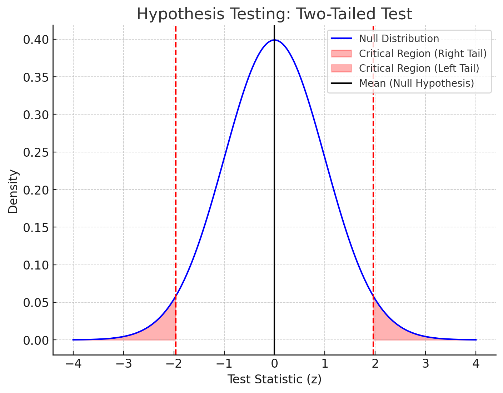
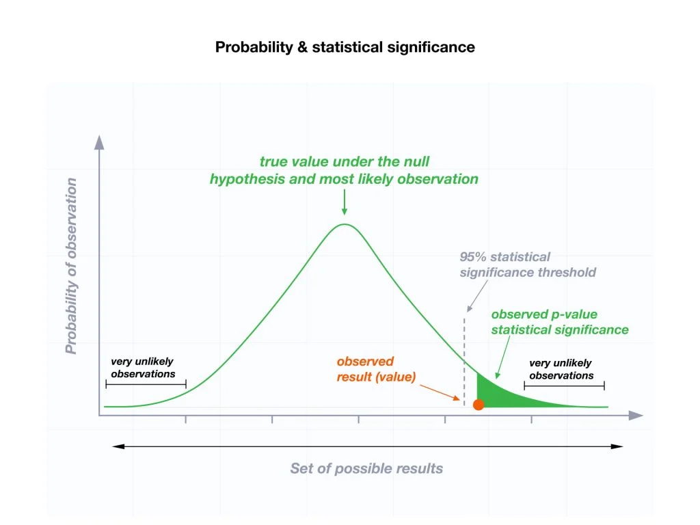
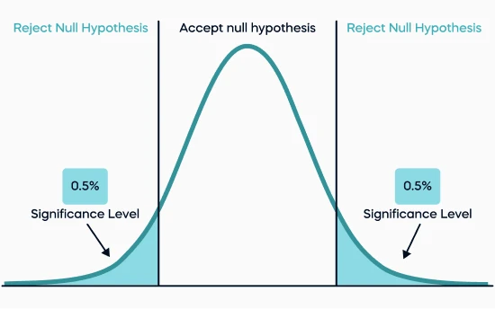

## Normal distribution: Introduction
- Why did we focus on normality?

<br>

  - The **normal distribution** is a key tool for determining the probability of a given value occurring in a population that follows this distribution.

<br>

  - It allows us to make inferences about a population by calculating how likely it is for data to fall within certain ranges.

<br>

  - Many statistical tests assume data follows a **normal distribution**, which helps in determining **significance** and making reliable conclusions.


-----------------------------------------------------------------------------------------------------------------

## Normal distribution: Introduction
- The normal distribution has two parameters: the mean (\(\mu\)) and the standard deviation (\(\sigma\)).

<br>

- If a **variable x** follows a normal distribution with a specific mean (\(\mu\)) and standard deviation (\(\sigma\)), we write this as:

::: columns
:::: column
```{r, echo=FALSE, message=FALSE, warning=FALSE, fig.width=2, fig.height=2}
# Load the necessary library
library(ggplot2)
library(dplyr)
# Parameters for the normal distribution
mean <- 0  # Mean 
sd <- 1    # Standard deviation 

# Generate a sequence of x values
x <- seq(-4, 4, length = 100)

# Calculate the density of the normal distribution for each x value
y <- dnorm(x, mean, sd)

# Create a data frame for ggplot
data <- data.frame(x = x, y = y)

# Plot the normal distribution
ggplot(data, aes(x = x, y = y)) +
  geom_line(color = "blue", size = 1) +
  geom_vline(xintercept = mean, linetype = "dashed", color = "red", size = 1) +
  labs(title = "", subtitle = expression(paste("")),x = "", y = "") +
  theme(axis.text.y = element_blank(), # Remove y-axis numbers
      #  axis.ticks.y = element_blank(), # Remove y-axis ticks
        axis.title.y = element_blank()) +# Remove y-axis title
  theme_minimal()

```
::::

:::: column
\vspace{2cm}
\[
x \sim N(\mu, \sigma)
\]
::::

:::

-----------------------------------------------------------------------------------------------------------------

## Converting to Standard Normal Distribution

- To simplify comparisons between different normal distributions, we often convert values to the **standard normal distribution**.

<br>

- The standard normal distribution has a \(\mu\) = \(0\) and a \(\sigma\) = \(1\).

<br>

- Any normal distribution can be converted into the standard normal distribution by using the **z-score** formula: \( z = \frac{x - \mu}{\sigma} \)


```{r, echo=FALSE, message=FALSE, warning=FALSE, fig.width=4, fig.height=2}
# Load necessary libraries
library(ggplot2)
library(cowplot)

# Define standard deviation and mean
mu <- 2
sd <- 1

# Create a data frame for the first plot (normal distribution centered at mu)
x_vals <- seq(mu - 4 * sd, mu + 4 * sd, length.out = 100)
dist1 <- dnorm(x_vals, mean = mu, sd = sd)
data1 <- data.frame(x = x_vals, y = dist1)

# Create a data frame for the second plot (normal distribution centered at 0)
x_vals2 <- seq(-4 * sd, 4 * sd, length.out = 100)
dist2 <- dnorm(x_vals2, mean = 0, sd = sd)
data2 <- data.frame(x = x_vals2, y = dist2)

# First plot: Normal distribution with mean mu
plot1 <- ggplot(data1, aes(x = x, y = y)) +
  geom_line(color = "blue", size = 1) +             # Plot the line
  geom_ribbon(data = subset(data1, x >= mu & x <= mu + sd), aes(ymin = 0, ymax = y), fill = "lightblue", alpha = 0.3) + # Fill light blue from mu to 1 SD
  labs(x = "", y = "") +
  scale_x_continuous(breaks = c(mu, mu + sd), labels = c(expression(mu), "x")) + # Label x-axis with mu and x at mu + 1 SD
  theme_minimal() +
  theme(axis.title.x = element_text(size = 14),axis.title.y = element_text(size = 14)
  )

# Second plot: Normal distribution with mean 0
plot2 <- ggplot(data2, aes(x = x, y = y)) +
  geom_line(color = "red", size = 1) +              # Plot the line
  geom_ribbon(data = subset(data2, x >= 0 & x <= 0 + sd), aes(ymin = 0, ymax = y), fill = "lightblue", alpha = 0.3) + # Fill light blue from 0 to 1 SD
  labs(x = "", y = "") +
  scale_x_continuous(breaks = c(0, 0 + sd), labels = c("0", "z")) + # Label x-axis with 0 and z at 1 SD
  theme_minimal() +
  theme(axis.title.x = element_text(size = 14), axis.title.y = element_text(size = 14)
  )

# Combine the two plots side by side
combined_plot <- plot_grid(plot1, plot2, labels = c("A", "B"), label_size = 8)

# Display the combined plot
print(combined_plot)

```

-----------------------------------------------------------------------------------------------------------------

## Hypothesis Testing, Probability and Distributions
- Hypothesis Testing
    - Null and alternative hypothesis
    - Test statistic

<br>

- \textcolor{gray}{Probability and Distributions}

<br>

- \textcolor{gray}{z-score}

-----------------------------------------------------------------------------------------------------------------

## Hypothesis Testing: Null and alternative hypothesis 

- A **null hypothesis** (denoted by \(H_0\)) is a statement of the status quo, one of **no difference or no effect**.   
  - If the null hypothesis is not rejected, no changes will be made.  

\centering
\(H_0\): \( \mu = \mu_0 \)
\

\vspace{1cm}


-----------------------------------------------------------------------------------------------------------------

## Hypothesis Testing: Null and alternative hypothesis 

- A **null hypothesis** (denoted by \(H_0\)) is a statement of the status quo, one of **no difference or no effect**.   
  - If the null hypothesis is not rejected, no changes will be made.  

\centering
\(H_0\): \( \mu = \mu_0 \)
\

\vspace{1cm}

- An **alternative hypothesis** (denoted by \(H_1\)) is one in which **some difference or effect is expected**. 

- One sided alternative hypothesis:  

\centering
\(H_1\): \( \mu < \mu_0 \)  or  \(H_1\): \( \mu > \mu_0 \)
\

- Two sided alternative hypothesis:  

\centering
\(H_1\): \( \mu \neq \mu_0 \)
\


-----------------------------------------------------------------------------------------------------------------

## Hypothesis Testing: Test statistic 
- All inferential tests use a formula that calculates a **test statistic**, quantifying the relationship or difference you are testing.

::: columns
:::: column
\small
- Independent t-test:
```{r echo=FALSE, results='asis'}
cat("$$t = \\frac{\\bar{X_1} - \\bar{X_2}}{\\sqrt{\\frac{s_1^2}{n_1} + \\frac{s_2^2}{n_2}}}$$")

```

  - Dependent t-test
```{r echo=FALSE, results='asis'}
cat("$$t = \\frac{\\bar{D}}{\\frac{s_D}{\\sqrt{n}}}$$")
```

  - One sample z-test
```{r echo=FALSE, results='asis'}
cat("$$z = \\frac{\\bar{X} - \\mu}{\\frac{\\sigma}{\\sqrt{n}}}$$")
```
\small  
::::

:::: column
\small
- F-test (ANOVA)
```{r echo=FALSE, results='asis'} 
cat("$$F = \\frac{MST}{MSE}$$")
```

- Pearson correlation
```{r echo=FALSE, results='asis'} 
cat("$$r = \\frac{\\sum (x_i - \\bar{x})(y_i - \\bar{y})}{\\sqrt{\\sum (x_i - \\bar{x})^2 \\sum (y_i - \\bar{y})^2}}$$")
```
\
::::
:::

-----------------------------------------------------------------------------------------------------------------

## Hypothesis Testing: Test statistic 
- The **normal distribution curve** allows us to calculate the **probability** of obtaining a **test statistic** as extreme as the one observed, assuming the **Null Hypothesis is true**.

<br>

- The **test statistic** is a value used in making a decision about the null hypothesis, and is found by converting the sample statistic to a score with the assumption that the null hypothesis is true

<br>

```{r, echo=FALSE, message=FALSE, warning=FALSE, fig.width=3.5, fig.height=2}
library(ggplot2)

# Define mean, standard deviation, and critical value for p < 0.05 (two-tailed)
mean <- 0  # Mean under the null hypothesis
sd <- 1    # Standard deviation for the standard normal distribution
test_stat <- 1.5  # Example of an observed test statistic

# Critical values for p < 0.05 in a two-tailed test (1.96 standard deviations)
critical_value <- qnorm(0.975, mean, sd)

# Create a sequence of x values for the plot
x_vals <- seq(mean - 4 * sd, mean + 4 * sd, length.out = 1000)

# Calculate the density (y-values) for the normal distribution
y_vals <- dnorm(x_vals, mean = mean, sd = sd)

# Create a data frame for plotting
data <- data.frame(x = x_vals, y = y_vals)

# Plot the normal distribution
ggplot(data, aes(x = x, y = y)) +
  geom_line(color = "blue", size = 1) +  # Plot the normal distribution curve
  geom_ribbon(data = subset(data, x <= -critical_value | x >= critical_value), 
              aes(ymin = 0, ymax = y), fill = "lightblue", alpha = 0.5) +  # Shade area beyond critical values
  geom_vline(xintercept = c(mean, mean + sd, mean - sd, mean + 2 * sd, mean - 2 * sd), 
             linetype = "dashed", color = "red", size = 0.3) +
  geom_vline(xintercept = c(-critical_value, critical_value), 
             color = "green", linetype = "solid", size = 0.3) +  # Lines for critical values
  scale_x_continuous(breaks = c(mean, mean - sd, mean + sd, mean - 2 * sd, mean + 2 * sd),
                     labels = c(expression(mu), expression(mu - sigma), expression(mu + sigma),
                                expression(mu - 2 * sigma), expression(mu + 2 * sigma))) +  # Label x-axis with mean and SDs
  labs(title = "", 
       x = "Test Statistic", 
       y = "Density") +
  theme_minimal() +
  theme(axis.title.x = element_text(size = 8),
        axis.title.y = element_text(size = 8),
        plot.title = element_text(hjust = 0.5))
```

-----------------------------------------------------------------------------------------------------------------

## Hypothesis Testing: Test statistic
- If the **probability** (i.e., *the area under the curve*) of obtaining such an extreme test statistic is less than our chosen significance level (*usually 0.05*), we consider the result to be **statistically significant**.

<br>

- In such cases, we may **reject the Null Hypothesis**, suggesting there is evidence for a difference or effect.
```{r, echo=FALSE, message=FALSE, warning=FALSE, fig.width=3, fig.height=2}
# Load necessary libraries
library(ggplot2)

# Define mean, standard deviation, and observed test statistic
mean <- 0  # Mean of the standard normal distribution (under null hypothesis)
sd <- 1    # Standard deviation of the standard normal distribution
test_stat <- 1.96  # Example test statistic for a 95% confidence level (for significance level of 0.05)

# Create a sequence of x values for the plot
x_vals <- seq(mean - 4 * sd, mean + 4 * sd, length.out = 1000)

# Calculate the density (y-values) for the normal distribution
y_vals <- dnorm(x_vals, mean = mean, sd = sd)

# Create a data frame for plotting
data <- data.frame(x = x_vals, y = y_vals)

# Plot the normal distribution
ggplot(data, aes(x = x, y = y)) +
  geom_line(color = "blue", size = 1) +  # Plot the normal distribution curve
  geom_vline(xintercept = test_stat, color = "red", linetype = "dashed", size = 1) +  # Mark the test statistic (1.96)
  geom_ribbon(data = subset(data, x >= test_stat), aes(ymin = 0, ymax = y), fill = "lightblue", alpha = 0.5) +  # Shade area beyond test statistic (p-value)
  labs(title = "", x = "Test Statistic (z)", y = "Density") +
  annotate("text", x = 2.5, y = 0.25, label = "Test Statistic (z = 1.96)", color = "red", angle = 90, size=2) +
  annotate("text", x = test_stat + 1.2, y = 0.05, label = "p-value < 0.05", color = "black", size = 2) +
  theme_minimal() +
  theme(
    axis.title.x = element_text(size = 6),
    axis.title.y = element_text(size = 6),
    plot.title = element_text(hjust = 0.5)
  )

```

-----------------------------------------------------------------------------------------------------------------

## Hypothesis Testing: Test statistic
- Another way to think about this:

::: columns

:::: column
\small
- If the **probability that our data fits the null distribution (i.e., the null hypothesis is true) is less than 5%**, we conclude that the data **does not fit the null**.
- This indicates a significant deviation from what we would expect by chance.
- We then **reject the null hypothesis**.
- The result is considered **statistically significant**.
\
::::

:::: column

```{r, echo=FALSE, fig.cap="", out.width = '80%', fig.align='center'}

```
::::

:::

-----------------------------------------------------------------------------------------------------------------


## Hypothesis Testing, Probability and Distributions
- \textcolor{gray}{Hypothesis Testing}

<br>

- Probability and Distributions

<br>

- \textcolor{gray}{z-score}

-----------------------------------------------------------------------------------------------------------------

## Before: p-value, significance and alfa level


-----------------------------------------------------------------------------------------------------------------

## Why p-value of less than **0.05**?

::: columns

:::: column

"It is usual and convenient for experimenters to take 5% as a standard level of significance, in the sense that they are prepared to ignore all results which fail to reach this standard, and, by this means, to eliminate from further discussion the greater part of the fluctuations which chance causes have introduced into their experimental results."

::::

:::: column
- Ronald Aylmer Fisher (1890-1962)

<br>

```{r, echo=FALSE, fig.cap="", out.width = '80%'}

```
::::

:::

-----------------------------------------------------------------------------------------------------------------

## What is a P-Value?
- The **p-value** (or probability value) is the probability of getting a value of the **test statistic** that is **at least as extreme** as the one representing the sample data, assuming that the null hypothesis is true

<br>

- Interpretation:

  - A small p-value indicates that the observed result is unlikely under the null hypothesis, suggesting evidence against it.  
  - A large p-value suggests that the observed result is consistent with the null hypothesis.


-----------------------------------------------------------------------------------------------------------------  

## Critical Region

- The critical region (or rejection region) is the set of all values of the test statistic that cause us to reject the null hypothesis.  

```{r, echo=FALSE, fig.cap="", out.width = '40%', fig.align='center'}

```

- Acceptance and rejection regions in case of a two-tailed test with 5% significance level.


----------------------------------------------------------------------------------------------------------------- 

## What is Significance?

:::::::::::::: {.columns}
::: {.column width="50%"}

- A statistical result is **significant** if it is **unlikely to have occurred by chance**.  

<br>

- Despite natural variability in the population, the probability of observing a value this extreme due to random variability is **low** (though not impossible).  

<br>

- We use probabilities (**p-values**) and an **alpha threshold (commonly 0.05)** to determine whether a result is significant.  

:::
::: {.column width="50%"}

\vspace{1.5cm}
```{r, echo=FALSE, fig.cap="", out.width = '100%', fig.align='center'}

```

:::
::::::::::::::

-----------------------------------------------------------------------------------------------------------------

## What is Significance?

:::::::::::::: {.columns}
::: {.column width="50%"}

- Significance refers to the risk of rejecting the null hypothesis when it is actually true.

<br>

- It tells us the probability that our result happened by chance alone.

<br>

- A p-value of 0.05 (5%) means there's a 5% chance the result is due to random chance.

<br>

- A p-value of 0.01 (1%) means there's a 1% chance the result happened by chance.
\tiny
  - A p-value of 0.01 indicates a low chance (1%) of the result occurring by chance, reflecting a more rigorous threshold for significance.
\

:::
::: {.column width="50%"}

\vspace{1.5cm}
```{r, echo=FALSE, fig.cap="", out.width = '70%', fig.align='center'}

```


:::
::::::::::::::

-----------------------------------------------------------------------------------------------------------------

## Focus - Types of Error

-----------------------------------------------------------------------------------------------------------------

## Focus - Types of Error

| Scenario                      | Null Hypothesis is True                                         | Null Hypothesis is False                                          |
|-------------------------------|-----------------------------------------------------------------|--------------------------------------------------------------------|
| **Reject Null Hypothesis**    | **Type I Error**: Incorrectly rejecting the null hypothesis.    | **Correct Decision**: Correctly rejecting the null hypothesis.    |
| **Fail to Reject Null Hypothesis** | **Correct Decision**: Correctly not rejecting the null hypothesis. | **Type II Error**: Incorrectly failing to reject the null hypothesis. |


-----------------------------------------------------------------------------------------------------------------


## Focus - Types of Error

| Scenario                      | Null Hypothesis is True                                         | Null Hypothesis is False                                          |
|-------------------------------|-----------------------------------------------------------------|--------------------------------------------------------------------|
| **Reject Null Hypothesis**    | **Type I Error**: Incorrectly rejecting the null hypothesis.    | **Correct Decision**: Correctly rejecting the null hypothesis.    |
| **Fail to Reject Null Hypothesis** | **Correct Decision**: Correctly not rejecting the null hypothesis. | **Type II Error**: Incorrectly failing to reject the null hypothesis. |

<br> 

\small
- Failing to reject the null hypothesis means our data didn't show a significant effect. **It doesn't prove the null hypothesis is true**; it just means we didn't find strong evidence against it.
\

-----------------------------------------------------------------------------------------------------------------

## Focus - Types of Error

- **Explanation**:  

:::::::::::::: {.columns}
::: {.column width="50%"}

- **Type I Error**: False positive. 
  - We conclude there is an effect or difference when there is none.  

<br>

- **Type II Error**: False negative. 
  - We fail to detect an effect or difference when one exists.  

<br>

- **Correct Decisions**: Accurately concluding the presence or absence of an effect or difference based on the truth of the null hypothesis.

:::
::: {.column width="50%"}

```{r, echo=FALSE, fig.cap="", out.width = '80%', fig.align='center'}
knitr::include_graphics("figs/pregnant.jpg")
```

:::
::::::::::::::

-----------------------------------------------------------------------------------------------------------------

## Calculating Significance
- To quantify a probability, you first need to calculate a **test statistic** and locate it on the normal probability curve.

<br>

- The normal curve acts as a statistical translator.
    - It helps you standardize your test statistic to a common scale.
    - This standardized value is then used to determine the probability of obtaining such a result in a standard normal population.


-----------------------------------------------------------------------------------------------------------------

## Hypothesis Testing, Probability and Distributions
- \textcolor{gray}{Hypothesis Testing}

<br>

- \textcolor{gray}{Probability and Distributions}

<br>

- z-score


-----------------------------------------------------------------------------------------------------------------

## z-score

- **z-scores** link measured or hypothesized values to probabilities.

<br>

- A z-score (or standard score) indicates how many standard deviations a value *_x_* is above or below the mean on the normal curve.

<br>

- It helps standardize values and connect them to probabilities.

<br>

- The z-score is calculated using the formula:

\[ z = \frac{(x - \mu)}{\sigma} \]

- where:  
  - \( x \) = the value of interest.  
  - \( \mu \) = mean of the population.  
  - \( \sigma \) = standard deviation of the population.  

-----------------------------------------------------------------------------------------------------------------

## z-scores: Linking observations to probabilities

- **z-scores** link observations to probabilities.

<br>

- Using a z-score for probability:
  - z-scores are essentially the **x-axis** of the standard normal distribution.
  - They normalize any data set so that the mean is 0 and the standard deviation is 1.
  - The area under the curve tells you the probability of a certain Z-score occurring.
  - By using the Z-score, we can determine the probability associated with different values.

-----------------------------------------------------------------------------------------------------------------

## Finding probabilities for z-scores
 
::: columns


:::: column
\vspace{1cm}

- **P(X < z)**: Denotes the probability of a value falling **less than** a given Z-score (\( z \)).

\vspace{1cm}

- **P(X > z)**: Denotes the probability of a value falling **above** a given Z-score (\( z \)).

\vspace{1cm}

- **P(z1 < X < z2)**: Denotes the probability of a value falling **between** two different Z-scores (\( z1 \) and \( z2 \)).

::::

:::: column
```{r, echo=FALSE, message=FALSE, warning=FALSE, fig.width=2.2, fig.height=3.5}
# Create a data frame for the standard normal distribution
df <- data.frame(x = seq(-4, 4, length.out = 1000))
df$y <- dnorm(df$x)

# Plot 1: P(X < z)
z1 <- 1  # Example Z-score
p1 <- ggplot(df, aes(x = x, y = y)) +
  geom_line() +
  geom_area(data = subset(df, x < z1), aes(x = x, y = y), fill = "blue", alpha = 0.3) +
  geom_vline(xintercept = z1, linetype = "dashed", color = "red") +
  labs(title = "P(X < z)", x = "Z-score", y = "") +
  theme_minimal()+
  theme(plot.title = element_text(size = 5),
        axis.title.x = element_blank(),
        axis.title.y = element_text(size = 8),
        axis.text.y = element_text(size = 4),
        axis.text.x = element_text(size = 4))  # Adjust title size here

# Plot 2: P(X > z)
z2 <- 1  # Example Z-score
p2 <- ggplot(df, aes(x = x, y = y)) +
  geom_line() +
  geom_area(data = subset(df, x > z2), aes(x = x, y = y), fill = "blue", alpha = 0.3) +
  geom_vline(xintercept = z2, linetype = "dashed", color = "red") +
  labs(title = "P(X > z)", x = "Z-score", y = "") +
  theme_minimal()+
  theme(plot.title = element_text(size = 5),
        axis.title.y = element_text(size = 8),
        axis.title.x = element_blank(),
        axis.text.y = element_text(size = 4),
        axis.text.x = element_text(size = 4))  # Adjust title size here

# Plot 3: P(z1 < X < z2)
z1 <- -1  # Example Z-score 1
z2 <- 1    # Example Z-score 2
p3 <- ggplot(df, aes(x = x, y = y)) +
  geom_line() +
  geom_area(data = subset(df, x > z1 & x < z2), aes(x = x, y = y), fill = "blue", alpha = 0.3) +
  geom_vline(xintercept = c(z1, z2), linetype = "dashed", color = "red") +
  labs(title = "P(z1 < X < z2)", x = "Z-score", y = "") +
  theme_minimal()+
  theme(plot.title = element_text(size = 5),
        axis.title.y = element_text(size = 8),
        axis.title.x = element_text(size = 8),
        axis.text.y = element_text(size = 4),
        axis.text.x = element_text(size = 4))  # Adjust title size here

# Arrange the plots in a grid
library(gridExtra)
grid.arrange(p1, p2, p3, ncol = 1)
```
::::

:::

-----------------------------------------------------------------------------------------------------------------

## Finding probabilities for z-scores using R

- **pnorm(z)**: Converts a z-score to a cumulative probability (areas under the curve).

<br>

- **qnorm(p)**: Converts a cumulative probability (areas under the curve) to a z-score.

-----------------------------------------------------------------------------------------------------------------

## Finding probabilities for z-scores using R

:::::::::::::: {.columns}
::: {.column width="50%"}
\small
- When you want the proportion of values larger than a certain value (right-side or upper tail):  
\centering
  - Use: **1 - pnorm(z_score)**
\
  - This calculates the area under the normal curve to the right of the specified value (z-score).

<br>

- When you want the proportion of values smaller than a certain value (left-side or lower tail):
\centering
  - Use: **pnorm(z_score)**
\
  - This gives you the area under the curve to the left of the specified value (z-score).
\
:::
::: {.column width="50%"}

```{r, echo=FALSE, message=FALSE, warning=FALSE}
# Define mean and standard deviation
mean_value <- 0.6
sd_value <- 0.2

# Define threshold value
threshold_value <- 1

# Create a sequence of x values for the plot
x_vals <- seq(mean_value - 4*sd_value, mean_value + 4*sd_value, length.out = 1000)

# Calculate normal density for the x values
y_vals <- dnorm(x_vals, mean = mean_value, sd = sd_value)

# Create data frame for plotting
data <- data.frame(x = x_vals, y = y_vals)

# Right Tail Plot (larger values)
right_tail_plot <- ggplot(data, aes(x, y)) +
  geom_line(size = 1, color = "blue") +  # Plot the normal distribution curve
  geom_area(data = subset(data, x >= threshold_value), aes(y = y), fill = "skyblue", alpha = 0.5) +  # Shade the right area
  geom_vline(xintercept = threshold_value, linetype = "dashed", color = "black", size = 1) +  # Mark the threshold value
  labs(title = "Right Tail: Proportion Above Threshold",
       subtitle = paste("Proportion of Values Above", threshold_value, ":", round(1 - pnorm(threshold_value, mean = mean_value, sd = sd_value), 4)),
       x = "Value",
       y = "Density") +
  theme_minimal()


# Left Tail Plot (smaller values)
left_tail_plot <- ggplot(data, aes(x, y)) +
  geom_line(size = 1, color = "blue") +  # Plot the normal distribution curve
  geom_area(data = subset(data, x <= threshold_value), aes(y = y), fill = "skyblue", alpha = 0.5) +  # Shade the left area
  geom_vline(xintercept = threshold_value, linetype = "dashed", color = "black", size = 1) +  # Mark the threshold value
  labs(title = "Left Tail: Proportion Below Threshold",
       subtitle = paste("Proportion of Values Below", threshold_value, ":", round(pnorm(threshold_value, mean = mean_value, sd = sd_value), 4)),
       x = "Value",
       y = "Density") +
  theme_minimal()

# Print the plots
print(right_tail_plot)
print(left_tail_plot)

```

:::
::::::::::::::  

-----------------------------------------------------------------------------------------------------------------

## Finding probabilities for z-scores using R

:::::::::::::: {.columns}
::: {.column width="50%"}

\vspace{1cm}
- For right-tail (upper tail): Use **qnorm(1 - p)** or **set lower.tail = FALSE**.

\vspace{2cm}
- For left-tail (lower tail): Use **qnorm(p)** where p is the cumulative probability.


:::
::: {.column width="50%"}

```{r, echo=FALSE, message=FALSE, warning=FALSE}
# Load necessary library
library(ggplot2)

# Define mean and standard deviation
mean_value <- 0.6
sd_value <- 0.2

# Define cumulative probabilities
p_left <- 0.25  # For the left tail
p_right <- 0.75  # For the right tail

# Calculate threshold values using qnorm
threshold_left <- qnorm(p_left, mean = mean_value, sd = sd_value)
threshold_right <- qnorm(1 - p_right, mean = mean_value, sd = sd_value)

# Create a sequence of x values for the plot
x_vals <- seq(mean_value - 4*sd_value, mean_value + 4*sd_value, length.out = 1000)

# Calculate normal density for the x values
y_vals <- dnorm(x_vals, mean = mean_value, sd = sd_value)

# Create data frame for plotting
data <- data.frame(x = x_vals, y = y_vals)

# Right Tail Plot (larger values)
right_tail_plot <- ggplot(data, aes(x, y)) +
  geom_line(size = 1, color = "blue") +  # Plot the normal distribution curve
  geom_area(data = subset(data, x >= threshold_right), aes(y = y), fill = "skyblue", alpha = 0.5) +  # Shade the right area
  geom_vline(xintercept = threshold_right, linetype = "dashed", color = "black", size = 1) +  # Mark the threshold value
  labs(title = "Right Tail: Cumulative Probability",
       subtitle = paste("Threshold Value (75th Percentile):", round(threshold_right, 2)),
       x = "Value",
       y = "Density") +
  theme_minimal()


# Left Tail Plot (smaller values)
left_tail_plot <- ggplot(data, aes(x, y)) +
  geom_line(size = 1, color = "blue") +  # Plot the normal distribution curve
  geom_area(data = subset(data, x <= threshold_left), aes(y = y), fill = "skyblue", alpha = 0.5) +  # Shade the left area
  geom_vline(xintercept = threshold_left, linetype = "dashed", color = "black", size = 1) +  # Mark the threshold value
  labs(title = "Left Tail: Cumulative Probability",
       subtitle = paste("Threshold Value (25th Percentile):", round(threshold_left, 2)),
       x = "Value",
       y = "Density") +
  theme_minimal()


# Print the plots
print(right_tail_plot)
print(left_tail_plot)
```

:::
:::::::::::::: 

-----------------------------------------------------------------------------------------------------------------

## Example

-----------------------------------------------------------------------------------------------------------------

## Example
:::::::::::::: {.columns}
::: {.column width="50%"}
\vspace{1cm}
- What percent of the area under the curve **falls below** a z-score of 0.76? 

<br>

- P (z<0.76)

:::
::: {.column width="50%"}
\vspace{1cm}
```{r, echo=FALSE, message=FALSE, fig.cap="", fig.width=3, fig.height=3.5}
# Create data for the normal distribution
z_values <- seq(-3, 3, length.out = 100)
y_values <- dnorm(z_values)

# Create a data frame
data <- data.frame(z = z_values, density = y_values)

# Plot the normal distribution and shade the area below z = 0.76
ggplot(data, aes(x = z, y = density)) +
  geom_line() +
  geom_area(data = filter(data, z <= 0.76), fill = "blue", alpha = 0.5) +
  geom_vline(xintercept = 0.76, linetype = "dashed", color = "red") +
  annotate("text", x = 2, y = 0.05, label = "P(z < 0.76)", color = "blue", size = 4) +
  labs(title = "", x = "Z-score", y = "Density") + theme_minimal()

```

:::
::::::::::::::


-----------------------------------------------------------------------------------------------------------------

## Example
:::::::::::::: {.columns}
::: {.column width="50%"}
\vspace{1cm}
- What percent of the area under the curve **falls below** a z-score of 0.76? 

<br>

- P (z<0.76)

```{r}
# Calculate the cumulative 
# probability for z = 0.76
z_score <- 0.76
p_value <- pnorm(z_score)
# Convert to percentage
percent_area <- p_value * 100
percent_area
```

:::
::: {.column width="50%"}
\vspace{1cm}
```{r, echo=FALSE, message=FALSE, fig.cap="", fig.width=3, fig.height=3.5}
# Create data for the normal distribution
z_values <- seq(-3, 3, length.out = 100)
y_values <- dnorm(z_values)

# Create a data frame
data <- data.frame(z = z_values, density = y_values)

# Plot the normal distribution and shade the area below z = 0.76
ggplot(data, aes(x = z, y = density)) +
  geom_line() +
  geom_area(data = filter(data, z <= 0.76), fill = "blue", alpha = 0.5) +
  geom_vline(xintercept = 0.76, linetype = "dashed", color = "red") +
  annotate("text", x = 2, y = 0.05, label = "P(z < 0.76)", color = "blue", size = 4) +
  labs(title = "",
       x = "Z-score",
       y = "Density") +
  theme_minimal()

```

:::
::::::::::::::


-----------------------------------------------------------------------------------------------------------------

## Example
:::::::::::::: {.columns}
::: {.column width="50%"}
\vspace{1cm}
- What is the z-score beyond which only 5% of all possible outcomes are higher? 

<br>

- (P>z) = 0.05

:::
::: {.column width="50%"}
\vspace{1cm}
```{r, echo=FALSE, message=FALSE, fig.cap="", fig.width=3, fig.height=3.5}
# Calculate the z-score for the upper 5%
p_value <- 0.95
z_score <- qnorm(p_value)

# Create data for the normal distribution
z_values <- seq(-3, 3, length.out = 100)
y_values <- dnorm(z_values)

# Create a data frame
data <- data.frame(z = z_values, density = y_values)

# Plot the normal distribution and shade the area above the z-score
ggplot(data, aes(x = z, y = density)) +
  geom_line() +
  geom_area(data = filter(data, z >= z_score), fill = "blue", alpha = 0.5) +
  geom_vline(xintercept = z_score, linetype = "dashed", color = "red") +
  annotate("text", x = z_score + 0, y = 0.05, label = "z where:\n P>z = 0.05", color = "red", size = 4) +
  labs(title = "", x = "Z-score", y = "Density") + theme_minimal()

```

:::
::::::::::::::


-----------------------------------------------------------------------------------------------------------------

## Example
:::::::::::::: {.columns}
::: {.column width="50%"}
\vspace{1cm}
- What is the z-score beyond which only 5% of all possible outcomes are higher? 

<br>

- (P>z) = 0.05
```{r}
# Calculate the z-score for 
# the upper 5% 
p_value <- 0.05
z_score <- qnorm(1-p_value)
# Print the result
z_score
```


:::
::: {.column width="50%"}
\vspace{1cm}
```{r, echo=FALSE, message=FALSE, fig.cap="", fig.width=3, fig.height=3.5}
# Calculate the z-score for the upper 5%
p_value <- 0.95
z_score <- qnorm(p_value)

# Create data for the normal distribution
z_values <- seq(-3, 3, length.out = 100)
y_values <- dnorm(z_values)

# Create a data frame
data <- data.frame(z = z_values, density = y_values)

# Plot the normal distribution and shade the area above the z-score
ggplot(data, aes(x = z, y = density)) +
  geom_line() +
  geom_area(data = filter(data, z >= z_score), fill = "blue", alpha = 0.5) +
  geom_vline(xintercept = z_score, linetype = "dashed", color = "red") +
  annotate("text", x = z_score + 0, y = 0.05, label = "z where:\n P>z = 0.05", color = "red", size = 4) +
  labs(title = "", x = "Z-score", y = "Density") + theme_minimal()

```

:::
::::::::::::::


-----------------------------------------------------------------------------------------------------------------

## Example

:::::::::::::: {.columns}
::: {.column width="50%"}

- In a distribution with a mean of 100 and a standard deviation of 15, what is the probability that a score will fall between 100 and 115 ? 

\[ Z = \frac{(x - \mu)}{\sigma} \]

\vspace{1cm}
- Before you can find any probabilities you have to find z-scores
  - Z = (100 - 100) /  15  =  0
  - Z = (115 - 100) /  15  =  1


:::
::: {.column width="50%"}

```{r, echo=FALSE, message=FALSE, fig.cap="", fig.width=3, fig.height=3.5}
# Parameters for the normal distribution
mean <- 100
sd <- 15

# Values to find the probability between
low_value <- 100
high_value <- 115

# Calculate the z-scores
z_low <- (low_value - mean) / sd
z_high <- (high_value - mean) / sd

# Calculate the probabilities using pnorm
p_low <- pnorm(z_low)
p_high <- pnorm(z_high)

# Probability of falling between 100 and 115
probability <- p_high - p_low

# Print the probability
print(paste("Probability of falling between 100 and 115:", round(probability, 4)))

# Create data for the normal distribution
x_values <- seq(mean - 4*sd, mean + 4*sd, length.out = 100)
y_values <- dnorm(x_values, mean, sd)

# Create a data frame
data <- data.frame(x = x_values, density = y_values)

# Plot the normal distribution and shade the area between 100 and 115
ggplot(data, aes(x = x, y = density)) +
  geom_line() +
  geom_area(data = filter(data, x >= low_value & x <= high_value), fill = "blue", alpha = 0.5) +
  geom_vline(xintercept = low_value, linetype = "dashed", color = "red") +
  geom_vline(xintercept = high_value, linetype = "dashed", color = "red") +
  labs(title = "", x = "Score", y = "Density") + theme_minimal()
```

:::
::::::::::::::

-----------------------------------------------------------------------------------------------------------------

## Example

:::::::::::::: {.columns}
::: {.column width="50%"}

- In a distribution with a mean of 100 and a standard deviation of 15, what is the probability that a score will fall between 100 and 115 ? 

```{r}
# Parameters
mean <- 100
sd <- 15
# Values
low_value <- 100
high_value <- 115

# Calculate the z-scores
z_low <- (low_value-mean)/sd
z_high <- (high_value-mean)/sd
```


:::
::: {.column width="50%"}

```{r, echo=FALSE, message=FALSE, fig.cap="", fig.width=3, fig.height=3.5}
# Parameters for the normal distribution
mean <- 100
sd <- 15

# Values to find the probability between
low_value <- 100
high_value <- 115

# Calculate the z-scores
z_low <- (low_value - mean) / sd
z_high <- (high_value - mean) / sd

# Calculate the probabilities using pnorm
p_low <- pnorm(z_low)
p_high <- pnorm(z_high)

# Probability of falling between 100 and 115
probability <- p_high - p_low

# Print the probability
print(paste("Probability of falling between 100 and 115:", round(probability, 4)))

# Create data for the normal distribution
x_values <- seq(mean - 4*sd, mean + 4*sd, length.out = 100)
y_values <- dnorm(x_values, mean, sd)

# Create a data frame
data <- data.frame(x = x_values, density = y_values)

# Plot the normal distribution and shade the area between 100 and 115
ggplot(data, aes(x = x, y = density)) +
  geom_line() +
  geom_area(data = filter(data, x >= low_value & x <= high_value), fill = "blue", alpha = 0.5) +
  geom_vline(xintercept = low_value, linetype = "dashed", color = "red") +
  geom_vline(xintercept = high_value, linetype = "dashed", color = "red") +
  labs(title = "", x = "Score", y = "Density") + theme_minimal()
```

:::
::::::::::::::

-----------------------------------------------------------------------------------------------------------------

## Example

:::::::::::::: {.columns}
::: {.column width="50%"}

- In a distribution with a mean of 100 and a standard deviation of 15, what is the probability that a score will fall between 100 and 115 ? 

```{r}
# Find the probabilities
p_low <- pnorm(z_low)
p_high <- pnorm(z_high)

# Probability of falling 
# between 100 and 115
probability <- p_high - p_low
probability
```


:::
::: {.column width="50%"}

```{r, echo=FALSE, message=FALSE, fig.cap="", fig.width=3, fig.height=3.5}
# Parameters for the normal distribution
mean <- 100
sd <- 15

# Values to find the probability between
low_value <- 100
high_value <- 115

# Calculate the z-scores
z_low <- (low_value - mean) / sd
z_high <- (high_value - mean) / sd

# Calculate the probabilities using pnorm
p_low <- pnorm(z_low)
p_high <- pnorm(z_high)

# Probability of falling between 100 and 115
probability <- p_high - p_low

# Print the probability
print(paste("Probability of falling between 100 and 115:", round(probability, 4)))

# Create data for the normal distribution
x_values <- seq(mean - 4*sd, mean + 4*sd, length.out = 100)
y_values <- dnorm(x_values, mean, sd)

# Create a data frame
data <- data.frame(x = x_values, density = y_values)

# Plot the normal distribution and shade the area between 100 and 115
ggplot(data, aes(x = x, y = density)) +
  geom_line() +
  geom_area(data = filter(data, x >= low_value & x <= high_value), fill = "blue", alpha = 0.5) +
  geom_vline(xintercept = low_value, linetype = "dashed", color = "red") +
  geom_vline(xintercept = high_value, linetype = "dashed", color = "red") +
  labs(title = "", x = "Score", y = "Density") + theme_minimal()
```

:::
::::::::::::::

-----------------------------------------------------------------------------------------------------------------


## Example

-----------------------------------------------------------------------------------------------------------------


## Example: Probability of a Cat Living to a Certain Age
- The lifespan of domestic cats is normally distributed with a mean of 15.7 years and a standard deviation of 1.6 years. 

::: columns

:::: column
\vspace{1cm}
- **Question**: What is the probability that a cat will live to be as old as Allison's 18-year-old cat?

::::

:::: column

::::

:::

-----------------------------------------------------------------------------------------------------------------

## Example: Probability of a Cat Living to a Certain Age
- The lifespan of domestic cats is normally distributed with a mean of 15.7 years and a standard deviation of 1.6 years. 

::: columns

:::: column
\vspace{1cm}
- **Question**: What is the probability that a cat will live to be as old as Allison’s 18-year-old cat?

<br>

- We're looking for the probability P(X > 18), which represents the probability that a cat will live longer than 18 years.

::::

:::: column
```{r, echo=FALSE, message=FALSE, warning=FALSE, fig.cap="", fig.width=3, fig.height=3.5}
# Load necessary libraries
library(ggplot2)

# Given values
mean_lifespan <- 15.7
sd_lifespan <- 1.6
age_allison_cat <- 18

# Define the Z-score
z_score <- (age_allison_cat - mean_lifespan) / sd_lifespan

# Generate a sequence of x-values (ages) covering the normal distribution
x_values <- seq(mean_lifespan - 4 * sd_lifespan, mean_lifespan + 4 * sd_lifespan, length = 1000)

# Calculate the density for each x-value
density <- dnorm(x_values, mean = mean_lifespan, sd = sd_lifespan)

# Create a data frame for ggplot
df <- data.frame(x = x_values, density = density)

# Define the critical Z-score for shading
shade_df <- df[df$x >= age_allison_cat, ]

# Plot the normal distribution with the shaded area for P(X > 18)
ggplot(df, aes(x = x, y = density)) +
  geom_line(color = "blue", size = 1) +  # Plot the normal distribution
  geom_area(data = shade_df, aes(x = x, y = density), fill = "red", alpha = 0.4) +  # Shade the area P(X > 18)
  geom_vline(xintercept = age_allison_cat, linetype = "dashed", color = "black") +  # Add a dashed line at Allison's cat's age
  labs(title = "Probability of a Cat Living to be as Old as Allison's Cat",
       subtitle = paste0("Mean = 15.7, SD = 1.6, Age = ", age_allison_cat),
       x = "Cat's Age",
       y = "Density") +
  theme(plot.title = element_text(size = 4)) + 
  theme_minimal()
```

::::

:::


## **Steps 1**:
-  **Calculate the Z-score**:

::: columns
:::: column

   \[
   Z = \frac{X - \mu}{\sigma}
   \]

- where:
   - \( X \) is the value (18 years),
   - \( \mu \) is the mean (15.7 years),
   - \( \sigma \) is the standard deviation (1.6 years).

::::

:::: column

\vspace{1cm}

   \[
   Z = \frac{18 - 15.7}{1.6} = \frac{2.3}{1.6} \approx 1.4375
   \]

::::

:::


## Step 2. 
- Find the Probability:

```{r}
# Given values
mean_lifespan <- 15.7
sd_lifespan <- 1.6
age_allison_cat <- 18
# Calculate Z-score
z_score <- (age_allison_cat - mean_lifespan) / sd_lifespan
# Find the probability that a cat lives longer than 18 years
probability <- 1 - pnorm(z_score)
probability
```

- Thus, the probability that a cat will live to be as old as or older than 18 years is approximately **0.0749** or **7.49%**.


## Step 2. 
- Find the Probability:

```{r}
# Given values
mean_lifespan <- 15.7
sd_lifespan <- 1.6
age_allison_cat <- 18
# Calculate Z-score
z_score <- (age_allison_cat - mean_lifespan) / sd_lifespan
# Find the probability that a cat lives longer than 18 years
probability <- 1 - pnorm(z_score)
probability
```

- This example walks you through calculating the probability in R using `pnorm()`, which calculates the cumulative probability under the normal distribution.


-----------------------------------------------------------------------------------------------------------------

## Another real life problems

-----------------------------------------------------------------------------------------------------------------

## Another real life problems
\small
- **Context**: The EPA is assessing drinking water standards to protect public health.
\

:::::::::::::: {.columns}
::: {.column width="50%"}
\small
- **Problem**: If the EPA sets the maximum allowable lead concentration in drinking water at 1ppm, and the lead concentrations in public buildings are normally distributed with a mean of 0.6 ppm and a standard deviation of 0.2ppm.
  - **What proportion of public buildings will exceed this threshold and require lead remediation?**
\

\vspace{1cm}

:::
::: {.column width="50%"}

:::
::::::::::::::


-----------------------------------------------------------------------------------------------------------------

## Another real life problems
\small
- **Context**: The EPA is assessing drinking water standards to protect public health.
\

:::::::::::::: {.columns}
::: {.column width="50%"}
\small
- Analysis Required:
  - Calculate the z-score for the threshold of 1 ppm.
  - Determine the proportion of buildings exceeding this lead level using the normal distribution.
\

:::
::: {.column width="50%"}
```{r}
# Parameters
mean <- 0.6
sd <- 0.2
# Threshold 4 lead remediation
threshold <- 1
# Calculate the z-score for the threshold
z_score<-(threshold-mean)/sd
# Calculate the proportion of 
#buildings above the threshold
threshold<-1-pnorm(z_score)
threshold
```

:::
::::::::::::::


##  
