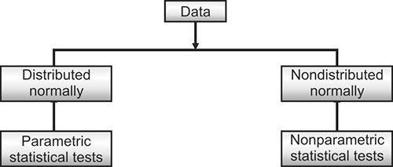

```{r, echo=FALSE, message=FALSE, warning=FALSE}
library(readxl)
library(readr)
library(lessR)
library(ggplot2)
library(patchwork)
library(palmerpenguins)
library(car)
library(ggforce) # for geom_circle
library(RVAideMemoire) #shapiro.test
library(DiagrammeR)
knitr::opts_chunk$set(dpi= 300)
xaringanExtra::use_panelset()
xaringanExtra::use_scribble()
xaringanExtra::use_search(show_icon = FALSE, position= "bottom-left") # Search
xaringanExtra::use_progress_bar(color = "#0051BA", location = "bottom", 
                                height = "4px")
xaringanExtra::use_clipboard() # Copy Code 
xaringanExtra::use_extra_styles(
  hover_code_line = TRUE,         #<<
  mute_unhighlighted_code = TRUE  #<<
)
xaringanExtra::use_editable(expires = 1) # Add textboxes to edit during presentation
```

# Expanding on Hypothesis Testing

- **Tails in hypothesis testing** represent the critical regions where **extreme values** of the test statistic indicate significant differences. If the test statistic falls in one of the tails, we reject the null hypothesis in favor of the alternative hypothesis.


$$
H_0: \mu = \mu_0 \quad \text{vs.} \quad 
H_1: \mu \neq \mu_0 \quad \text{or} \quad 
H_1: \mu < \mu_0 \quad \text{or} \quad 
H_1: \mu > \mu_0
$$

   - where:
    - $μ$ = True population mean (unknown, what we're testing)
    - $μ_0$ = Hypothesized population mean (the reference value in $H_0$)

--

- To test this hypothesis, we define both rejection and acceptance regions. These regions are determined by our chosen significance level, typically set at **0.05**.

---
# Types of Hypothesis Tests:

.pull-left[
1. Left-tailed test:

2. Right-tailed test:

3. Two-tailed test: 
]
.pull-right[]

---
# Types of Hypothesis Tests

.pull-left[
- **Left-tailed test**: Tests if the sample mean is significantly **less than** the population mean.
    - Decrease
    - Cooler
    - Smaller
    - Lower

]
.pull-right[
.center[
```{r, echo=FALSE, message=FALSE, warning=FALSE, fig.width=2, fig.height=2}
library(ggplot2)
# Set the significance level
p <- 0.05

# Create a sequence for the lower tail (left tail of the normal distribution)
tail_low <- seq(-4, qnorm(p), 0.01)
df_tl <- data.frame(x = c(tail_low, qnorm(p)), y = c(dnorm(tail_low), 0))

# Plot the normal distribution
ggplot(data.frame(x = c(-4, 4)), aes(x)) +
  stat_function(fun = dnorm) +  # Plot the normal distribution
  geom_polygon(data = df_tl, aes(x, y), fill = "#99CCFF") +  # Fill the lower tail (P(X < x))
  geom_vline(xintercept = qnorm(p), lty = "dashed", lwd = 0.3) +  # Vertical line at the critical value for left tail

  annotate(geom = "text", x = -2.7, y = 0.3, label = 'P<x') +  # Annotate the critical value
  
  theme_classic() +  # Clean theme
  labs(x = "", y = "")  # Remove axis labels

```
]]

---
# Types of Hypothesis Tests

.pull-left[
- **Right-tailed test**: Tests if the sample mean is significantly **greater than** the population mean.
    - Increase
    - Warmer
    - Higher
    - Expand

]
.pull-right[
.center[
```{r, echo=FALSE, message=FALSE, warning=FALSE, fig.width=2, fig.height=2}
# Set the significance level
p <- 0.05

# Create a sequence for the upper tail (one-tailed test)
tail_high <- seq(qnorm(1-p), 4, 0.01)
df_th <- data.frame(x = c(qnorm(1-p), tail_high), y = c(0, dnorm(tail_high)))

# Plot the normal distribution
ggplot(data.frame(x = c(-4, 4)), aes(x)) +
  stat_function(fun = dnorm) +  # Plot the normal distribution
  geom_polygon(data = df_th, aes(x, y), fill = "#99CCFF") +  # Fill the upper tail
  geom_vline(xintercept = qnorm(1-p), lty = "dashed", lwd = 0.3) +  # Vertical line at the critical value
  annotate(geom = "text", x = 2.7, y = 0.3, label = 'P>x') +  # Annotate the critical value
  
  theme_classic() +  # Clean theme
  labs(x = "", y = "")  # Remove axis labels
```
]]

---
# Types of Hypothesis Tests

- If your obtained test statistic falls beyond the critical value (in the light blue region) for your given significance level ( $\alpha$ ), the result is significant, and you **reject the null hypothesis**.


.pull-left[
- **Left-tailed test**
```{r, echo=FALSE, message=FALSE, warning=FALSE, fig.width=2, fig.height=2}
library(ggplot2)
# Set the significance level
p <- 0.05

# Create a sequence for the lower tail (left tail of the normal distribution)
tail_low <- seq(-4, qnorm(p), 0.01)
df_tl <- data.frame(x = c(tail_low, qnorm(p)), y = c(dnorm(tail_low), 0))

# Plot the normal distribution
ggplot(data.frame(x = c(-4, 4)), aes(x)) +
  stat_function(fun = dnorm) +  # Plot the normal distribution
  geom_polygon(data = df_tl, aes(x, y), fill = "#99CCFF") +  # Fill the lower tail (P(X < x))
  geom_vline(xintercept = qnorm(p), lty = "dashed", lwd = 0.3) +  
    annotate("text", x = -2.95, y = 0.3, label = "Critical value", color = "red", angle = 90, size=3) +
  
  annotate(geom = "text", x = -2.9, y = 0.15, label = sprintf("%.2f", qnorm(p)), size=3) +
  annotate(geom = "text", x = -3.3, y = 0.05, label = "0.05", size=3) +  
  theme_classic() +  # Clean theme
  labs(x = "", y = "")  # Remove axis labels

```
]
.pull-right[
- **Right-tailed test** 
```{r, echo=FALSE, message=FALSE, warning=FALSE, fig.width=2, fig.height=2}
# Set the significance level
p <- 0.05

# Create a sequence for the upper tail (one-tailed test)
tail_high <- seq(qnorm(1-p), 4, 0.01)
df_th <- data.frame(x = c(qnorm(1-p), tail_high), y = c(0, dnorm(tail_high)))

# Plot the normal distribution
ggplot(data.frame(x = c(-4, 4)), aes(x)) +
  stat_function(fun = dnorm) +  # Plot the normal distribution
  geom_polygon(data = df_th, aes(x, y), fill = "#99CCFF") +  # Fill the upper tail
  geom_vline(xintercept = qnorm(1-p), lty = "dashed", lwd = 0.3) +  # Vertical line at the critical value
  annotate("text", x = 2.75, y = 0.3, label = "Critical value", color = "red", angle = 90, size=3) +

  annotate(geom = "text", x = 2.7, y = 0.15, label = sprintf("%.2f", qnorm(1-p)), size=3) +  
  annotate(geom = "text", x = 3, y = 0.05, label = "0.05", size=3) +  
  
  
  theme_classic() +  # Clean theme
  labs(x = "", y = "")  # Remove axis labels

```
]

---

## Expanding on Hypothesis Testing 
- 2-tailed tests: 
    - Have **no expected directionality hypothesized**.
    - Split the 5% significance level (α = 0.05) between both tails of the normal distribution curve (i.e., 2.5% in each tail).
    - Are therefore more conservative and less powerful than one-tailed tests, meaning they require stronger evidence to reject the null hypothesis.

.center[
```{r, echo=FALSE, message=FALSE, fig.cap="", fig.width=1.8, fig.height=1.4}
p <- 0.025
tail_low <- seq(-4, qnorm(p), 0.01)
df_tl <- data.frame(x=c(tail_low,qnorm(p)), y =c(dnorm(tail_low),0))
tail_high <- seq(qnorm(1-p), 4, 0.01)
df_th <- data.frame(x=c(qnorm(1-p),tail_high), y=c(0,dnorm(tail_high)))

ggplot(data.frame(x = c(-4, 4)), aes(x)) +
  stat_function(fun = dnorm) +
  geom_polygon(data = df_tl, aes(x,y), fill = "#99CCFF") +
  geom_polygon(data = df_th, aes(x,y), fill = "#99CCFF") +
  geom_vline(xintercept = qnorm(p), lty = "dashed", lwd = 0.3) +
  geom_vline(xintercept = qnorm(1-p), lty = "dashed", lwd = 0.3) +
  
  annotate("text", x = -2.80, y = 0.3, label = "Critical value", color = "red", angle = 90, size=2) +
  annotate(geom = "text", -2.9, 0.15, label = "-1.96", size=2.5) +
  annotate(geom = "text", 2.7, 0.15, label = "1.96", size=2.5) +
  
  annotate("text", x = 2.50, y = 0.3, label = "Critical value", color = "red", angle = 90, size=2) +
  annotate(geom = "text", -3.3, 0.05, label = "0.025", size=2.5) +
  annotate(geom = "text",  3.2, 0.05, label = "0.025", size=2.5) +
  
  theme_classic() +
  labs(x="", y="") +
  theme(
    axis.text.x = element_text(size = 6),  # Adjust x-axis text size
    axis.text.y = element_text(size = 6)   # Adjust y-axis text size
  )
```
]

---
# Critical Value: Definition and Origin

- A **critical value** is the threshold beyond which **we reject the null hypothesis** ( $H_0$ ) in a statistical test. It is determined by the significance level ( $\alpha$ ), which represents the probability of making a Type I error (rejecting a true null hypothesis).

- It separates the **rejection region** (where you reject the null hypothesis) from the **non-rejection region** on the distribution curve of the test statistic. 

- The critical value indicates how many standard deviations away from the mean we must go to enter the rejection region. For example, a critical value of $\pm$ 1.645 means we are 1.645 standard deviations away from the mean in a one-tailed test.

---
# Critical Values for Common Significance Levels:
- For a **one-tailed test**, the critical value is based on **α = 0.05** (either 5% in one tail, left or right).
- For a **two-tailed test**, the **α = 0.05** is split into **0.025 in each tail**, leading to critical values of **±1.96**.

---
# Critical Values in R

.pull-left[
```{r}
one_tail_right <- qnorm(1 - 0.05)  # One-tailed test critical value (right tail)
one_tail_left <- qnorm(0.05)       # One-tailed test critical value (left tail)
two_tail <- c(qnorm(0.025), qnorm(0.975))
```
]
.pull-right[
```{r}
one_tail_right
one_tail_left
two_tail
```
]

---
## Understanding Critical Values and Probabilities in Z-tests

| Question Type | Given | Function | Example |
| --- | --- | --- | --- |
| Find probability (area below z-score) (one-tailed, left, smaller, less than) | z-score | `pnorm(z)` | `pnorm(-1.645)` → 0.05 |
| Find probability (area above z-score) (one-tailed, right, beyond, larger than) | z-score | `1 - pnorm(z)` | `1 - pnorm(1.645)` → 0.05 |
| Find z-score for left cumulative area (two-tailed, left, smaller, less than, α = 0.05) | Probability | `qnorm(p)` | `qnorm(0.025)` → -1.96 |
| Find z-score for right cumulative area (two-tailed, right, beyond, larger than, α = 0.05) | Probability | `qnorm(1 - p)` | `qnorm(1 - 0.025)` → 1.96 |


- Important Note
    - In the table, examples with 0.05 correspond to critical values for a one-tailed test.
    - For a two-tailed test with $\alpha$ = 0.05, the rejection region is split into two parts, with 0.025 in each tail, leading to critical values of ±1.96.
    
---
# Critical Values in R

**Reminder:**  
- **One-tailed test (α = 0.05):** The rejection region is entirely in one tail. The **critical value** separates the rejection region from the non-rejection region, where we reject the null hypothesis if the test statistic exceeds this value.
  - **Critical values: ±1.645**  
  - `qnorm(0.05) = -1.645` (left tail, 5%)  
  - `qnorm(1 - 0.05) = qnorm(0.95) = 1.645` (right tail, 95%)
  
- **Two-tailed test (α = 0.05):** The rejection regions are split into the lower 2.5% and upper 2.5%. The critical values define the boundaries for the two rejection regions.
  - **Critical values: ±1.96**  
  - `qnorm(0.025) = -1.96` (left tail, 2.5%)  
  - `qnorm(1 - 0.025) = qnorm(0.975) = 1.96` (right tail, 97.5%)  

---
# Significant or Not?

.pull-left[
- **Not Significant**:  
  - Fail to reject the null hypothesis.
      - We fail to reject because in statistics, we cannot prove anything with 100% certainty; we just don't have enough evidence to reject it.
  - There is **no** sufficient evidence to suggest a difference between the sample and population mean.
  - Obtained test statistic **<** critical value threshold.
  - p-value **>** alpha threshold (usually 0.05).  
]

.pull-right[
- **Significant**:
  - Reject the null hypothesis.
  - There **is** sufficient evidence to suggest a difference between the sample and population mean.
  - Obtained test statistic **>** critical value threshold.
  - p-value **<** alpha threshold (usually 0.05).  
]

---
# Basic steps for an **Inferential Test**
.pull-left[
- A statement of null hypothesis:
    - Know the research Hypothesis.
- Choose the appropriate test:
    - Including if a 1 or 2-tailed test.
- Set the level of Type I error risk ( $\alpha$ ):
    - Usually < 0.05.
- Analyze data distribution:
    - Do you meet assumptions like normality and independence?
- Compute the test statistic (obtained) value:
    - Calculated from formula.

]
.pull-right[
- Assess significance:
    - Determine the critical value needed to  reject the null hypothesis and compare it to your:
      - |calculated| > critical value = significant.
- Determine the p-value associated with your calculated test statistic.
      - P-value < alpha threshold = significant
- Summarize:
    f- Clear, succinct paragraph with all pertinent information and interpretation.
]

---
# Basic steps for an **Inferential Test**

- We can select an appropriate test simply by answering some questions.

1. What type of data do we have?
  
2. What type of research question are we considering?

---
# Basic steps for an **Inferential Test**

- We can select an appropriate test simply by answering some questions.

1. What type of data do we have?
    - If we have frequency data, we select a test from the Chi-square family.
    - If we have continuous and categorical variables, the appropriate test depends on the research question:
  
2. What type of research question are we considering?
    - If we are comparing one sample mean to a population mean, we use a **z-test**.
    - If the focus is on differences between groups or treatments, we select a test from the **t-test or ANOVA** family.
    - If we are interested in relationships between variables, we use **correlation tests**.
    - If the goal is to predict outcomes, we use the **regression family**.
    
---
# Statistical shorthand **z-test** example

---
# Statistical shorthand **z-test** example

$$z_{(100)} = 1.4, \quad p = 0.16$$

---
# Statistical shorthand **z-test** example

$$z_{(100)} = 1.4, \quad p = 0.16$$

$${\huge \downarrow}$$

$$\underbrace{z_{\underbrace{(100)}_{\text{Sample size}}}}_{\text{Test statistic}} = \underbrace{1.4}_{\text{z-value}}, \quad \underbrace{p = 0.16}_{\text{p-value}}$$

--
- Every statistical test has a letter designating the type of test.
- Because power is so closely tied to sample size, we report sample size.
- For clarity (and to confirm the correct-tailed test is used to assess the p-value), include the calculated test statistic value.
- Always report the p-value.
- Some tests will also include a secondary metric to assess how meaningful results are (if significant).

---
# How to summarize your analysis: Key Components of a Statistical Summary

.teal[Before installing a new air quality monitoring instrument, we tested to see if a sample of measurements taken at the testing lab differed significantly different from the long-term mean for the larger network population.]

.orange[Using a 2-tailed, one-sample z-test for on our normally distributed samples (W = 0.78).]

<span style="color:#005EB8;"> While the mean of the new instrument sample was slightly higher (sample mean = 117 vs. population mean = 108), we found no significant difference $z_{(100)}$ = 1.4, $p$ = 0.16.</span>

.black[Based on these results we approve the installation of this instrument at the new site. However, we would suggest statistical comparisons of the current and new unit side-by-side, prior to decommissioning the current instrument.]


---
# How to summarize your analysis: Key Components of a Statistical Summary

.teal[**Introduction/Background:** Before installing a new air quality monitoring instrument, we tested to see if a sample of measurements taken at the testing lab differed significantly different from the long-term mean for the larger network population.]

.orange[**Methods:**Using a 2-tailed, one-sample z-test for on our normally distributed samples (W = 0.78).]

<span style="color:#005EB8;"> **Results:** While the mean of the new instrument sample was slightly higher (sample mean = 117 vs. population mean = 108), we found no significant difference $z_{(100)}$ = 1.4, $p$ = 0.16.</span>

.black[**Implications:** Based on these results we approve the installation of this instrument at the new site. However, we would suggest statistical comparisons of the current and new unit side-by-side, prior to decommissioning the current instrument.]


---
# One sample z-test

---
# When would you run a one-sample z-test?
- Use the One Sample z-test when:
  1. You want to test for a **difference** between one **sample mean** and a larger **population mean**.
  2. There is only **one group (sample)** being tested against the larger **population**.
  3. You know (or can estimate) the mean and standard deviation of the population.
      - Expert Information.
      - Scientific Literature.
      - Data archives.
      - Meaningful (hypothesized value).
  4. Data is normally distributed.


---
# One sample z-test formula
- The formula for the one-sample z-test is:

$$z = \frac{\bar{X} - \mu}{\frac{\sigma}{\sqrt{n}}}$$

- where:  
    - $\bar{X}$: Sample mean.  
    - $\mu$: Population mean.  
    - $\sigma$: Population standard deviation.
    - $n$: Sample size.

---

## Flowcharts: 

```{r, echo=FALSE, fig.cap="", out.width = '60%', fig.align='center'}

```


---
# Flowcharts

```{r, echo=FALSE, fig.cap="", out.width = '100%', fig.align='center'}
knitr::include_graphics("fig/which_test_flowchart.png")
```


---
# Flowcharts

```{r figure_1, echo = FALSE, fig.align='center'}
DiagrammeR::mermaid("
    graph TD;
        A[What type of data?]--> B[Continuous];
        B--Research Question--> C[Differences];
        B--Research Question--> D[Relationships];
        C --Num. samples to compare--> E[1 group]
        E --> F[Normally distribute?];
        F --Yes--> G[One sample z-test];
        F --No--> H[Wilcoxon signed rank z-test]

    ", height = '500px', width = '900px'
    )

```

---
# One sample z-test

- Assume you have a sample of **20 observations**. The mean of this **sample is 150**, and you want to determine whether there is a **difference between the sample mean and the larger population mean**. Since you are not specifying a direction for this difference, you will conduct a two-tailed test.

- The **population mean is 164**, and the **population standard deviation is 33**.

--

- Next, calculate the obtained value for this **one-sample z-test.**

.pull-left[$$z = \frac{\bar{X} - \mu}{\frac{\sigma}{\sqrt{n}}}$$
]

.pull-right[
$$z = \frac{150 - 164}{\frac{33}{\sqrt{20}}} = -1.897$$
]

---
# One sample z-test

- Assume you have a sample of **20 observations**. The mean of this **sample is 150**, and you want to determine whether there is a **difference between the sample mean and the larger population mean**. Since you are not specifying a direction for this difference, you will conduct a two-tailed test.
- The **population mean is 164**, and the **population standard deviation is 33**.
- Next, calculate the obtained value for this **one-sample z-test.**

.pull-left[
```{r, echo=FALSE, message=FALSE, warning=FALSE, fig.width=2.2, fig.height=1.7}
p <- 0.025
tail_low <- seq(-4, qnorm(p), 0.01)
df_tl <- data.frame(x=c(tail_low,qnorm(p)), y =c(dnorm(tail_low),0))
tail_high <- seq(qnorm(1-p), 4, 0.01)
df_th <- data.frame(x=c(qnorm(1-p),tail_high), y=c(0,dnorm(tail_high)))

ggplot(data.frame(x = c(-4, 4)), aes(x)) +
  stat_function(fun = dnorm) +
  geom_polygon(data = df_tl, aes(x,y), fill = "#99CCFF") +
  geom_polygon(data = df_th, aes(x,y), fill = "#99CCFF") +
  geom_vline(xintercept = qnorm(p), lty = "dashed", lwd = 0.3) +
  geom_vline(xintercept = qnorm(1-p), lty = "dashed", lwd = 0.3) +
  annotate(geom = "text", -3, 0.15, label = "Reject\n Null", size=3) +
  annotate(geom = "text", 3, 0.15, label = "Reject\n Null", size=3) +
  
  annotate(geom = "text", -3.3, 0.05, label = "0.025", size=3) +
  annotate(geom = "text",  3, 0.05, label = "0.025", size=3) +
  
  theme_classic() +
  labs(x="", y="")
```
]

.pull-right[
$$z = \frac{150 - 164}{\frac{33}{\sqrt{20}}} = -1.897$$
]

---
# Critical value approach

- In the critical value approach, we compare the calculated **test statistic** to the **critical value** from the standard normal distribution. 

- For a **two-tailed test** at the $\alpha$ = 0.05 significance level, the critical values are approximately ±1.96, which corresponds to the **0.025** in each tail.

--

- Decision Rule:
    - If |calculated test statistic| > critical value → **Statistically Significant.**
    - If |calculated test statistic| ≤ critical value → **Not Statistically Significant.**

---
# Critical Value Approach

- In this case:

$$|-1.897| < 1.96$$

- Thus, we fail to reject the null hypothesis, indicating that there is **no significant** difference between the sample mean and the population mean.

---
# Finding the p-value

- Now we need to determine the probability (p-value) associated with the calculated test statistic. You have several options to achieve this:

```{r highlight.output = 1}
z_value <- -1.897
p_value <- 2 * pnorm(z_value)  # Two-tailed p-value
p_value  # This will give the result
```

--

- Since this p-value (0.0578) is greater than the alpha threshold of 0.05, we conclude that the result is **not significant**.

---
# Example: Car rental


---
# Example: Car rental

- A rental car company claims the mean time to rent a car on their **website is 60 seconds with a standard deviation of 30 seconds**. A random sample **36 customers** attempted to rent a car on the website. The **mean time to rent was 75 seconds**. Is this enough evidence to contradict the company's claim?


--

- Step 1: Set up the hypotheses

.pull-left[
- **Null hypothesis ( $H_0$ )**: The mean rental time is 60 seconds.
$$H_0: \mu = 60$$
]

.pull-right[
- **Alternative hypothesis ( $H_1$ )**: The mean rental time is greater than 60 seconds.
$$H_1: \mu > 60$$
]

---
# Example: Car rental

- A rental car company claims the mean time to rent a car on their **website is 60 seconds with a standard deviation of 30 seconds**. A random sample **36 customers** attempted to rent a car on the website. The **mean time to rent was 75 seconds**. Is this enough evidence to contradict the company's claim?

--

- Step 2: Test statistic formula

.pull-left[
$$z = \frac{\bar{X} - \mu}{\frac{\sigma}{\sqrt{n}}}$$
]

.pulls-right[
$$z = \frac{75 - 60}{\frac{30}{\sqrt{36}}} = \frac{15}{5} = 3$$
]


---
# Example: Car rental

- A rental car company claims the mean time to rent a car on their **website is 60 seconds with a standard deviation of 30 seconds**. A random sample **36 customers** attempted to rent a car on the website. The **mean time to rent was 75 seconds**. Is this enough evidence to contradict the company's claim?

--

- Step 2: Test statistic formula

.pull-left[
$$|3| > 1.645$$
]

.pulls-right[
$$z = \frac{75 - 60}{\frac{30}{\sqrt{36}}} = \frac{15}{5} = 3$$
]

---
# Example: Car rental

- A rental car company claims the mean time to rent a car on their **website is 60 seconds with a standard deviation of 30 seconds**. A random sample **36 customers** attempted to rent a car on the website. The **mean time to rent was 75 seconds**. Is this enough evidence to contradict the company's claim?
\vspace{0.5cm}

- Step 3: Set up the hypotheses

.pull-left[
For a **one-tailed test** at a significance level of $\alpha$ = 0.05, the critical z-value is approximately **1.645** (since we are only looking at one tail).
]

.pulls-right[
```{r highlight.output = 1}
# Given z-value
z_value <- 3
# Calculate the one-tailed p-value
p_value <- 1 - pnorm(z_value)
p_value # Print the p-value
```
]

---
# Example: Car rental

.teal[We tested a rental car company's claim that reservations could be made online in 60 seconds on average.] .orange[Using a random sample of 36 online rentals in a one-tailed, one-sample z-test] <span style="color:#005EB8;">we found that mean reservation time is actually significantly higher than the company claims ( $z_{(36)}=3, p=0.001$ ).</span> .darkgray[This result indicates that it is highly unlikely customers can rent a car in 60 seconds as claimed.  We suggest that the rental company adjust its claim to match the 75 second mean encountered for our test sample to avoid misleading potential customers.]


---
# Example: Another example

---
# Example: Another example

A water quality regulation specifies that the lead level in drinking water should be no more than **15 ppb** ( $\mu$ ) with a standard deviation ( $\sigma$ = 0.25. A random sample of three lead measurements yielded values of 15.84, 15.33, and 15.58. Perform a one-sided z-test to determine if the mean lead level exceeds 15 ppb. 

.pull-left[
$$H_0: \mu = 15$$
]

.pull-right[
$$H_1: \mu > 15$$
]  


---
# Example: Another example
```{r eval=FALSE}
# install.packages("BSDA") #first install the library, if you have not this library installed.
# simply remove the # sign and run this line
library(BSDA)  # Load the BSDA package

z.test(x, 
       alternative = "greater",  # Specify alternative hypothesis: "greater", "less", or "two.sided"
       mu = ,  # Population mean (to test against)
       sigma.x = )  # Population standard deviation
```

--

- where:
    - x: Sample data values.
    - alternative: Specifies the alternative hypothesis. Options:
      - "greater": Tests if the sample mean is significantly greater than mu.
      - "less": Tests if the sample mean is significantly smaller than mu.
      - "two.sided": Tests for any significant difference from mu.
    - mu: The hypothesized population mean.
    - sigma.x: The known population standard deviation.

---
# Example: Non-parametric Wilcoxon signed-rank test

- To perform a one-sample Wilcoxon test, R provides a function wilcox.test() that can be used as follow:
```{r eval=FALSE}
wilcox.test(x, 
            alternative = "greater",  # Specify alternative hypothesis: "greater", "less", or "two.sided"
            mu = 0)  # the theoretical mean/median value. Default is 0 but you can change it.
```

- where:
    - x: Sample data values.
    - alternative: Specifies the alternative hypothesis. Options:
      - "greater": Tests if the sample median is significantly greater than mu.
      - "less": Tests if the sample median is significantly smaller than mu.
      - "two.sided": Tests for any significant difference from mu.
    - mu: The hypothesized population median.

---
# Example: Another example

```{r, echo=FALSE, message=FALSE, warning=FALSE, highlight.output = 5}
library(BSDA)
water_sample = c(15.84, 15.33, 15.58)
z.test(water_sample, mu=15,  sigma.x = 0.25, alternative="greater")
```

- The test statistic for the one-sample **z-test is 4.0415** and the corresponding **p-value** is $p = 2.66 \times 10^{-5}$ .

---
# Example: Another example

.teal[We tested a water sample to determine whether the mean lead level exceeds the regulatory limit of 15 ppb.] .orange[Using a random sample of three lead measurements in a one-tailed, one-sample z-test,] <span style="color:#005EB8;">we found that the mean lead level is significantly greater than the regulatory limit ( $z_{(3)} = 4.04, \ p = 2.66 \times 10^{-5}$ ).</span> .darkgray[This result indicates that it is highly unlikely that the true mean lead level is 15 ppb or lower. We suggest further investigation and corrective actions to reduce the lead concentration, as the sample mean was 15.58 ppb.]  


