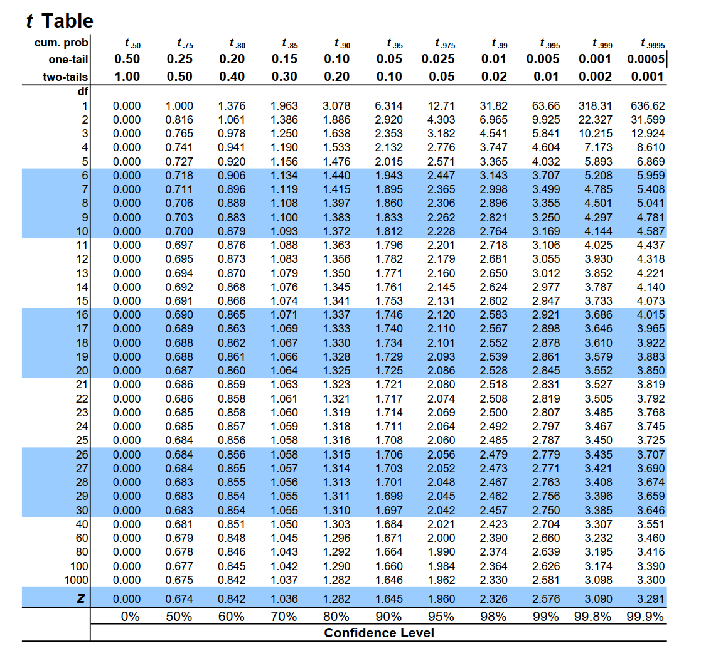

```{r, echo=FALSE, message=FALSE, warning=FALSE}
library(ggpubr)
library(cowplot)
library(DiagrammeR)
```

# t-test

- A **t-test** is an inferential statistic used to determine if there is a statistically significant difference between the means of two variables.

- **Student t-test** is named after its inventor, William Gosset, who published under the pseudonym of student.

<center>
```{r, echo=FALSE, message=FALSE, warning=FALSE, fig.width=4.5, fig.height=5}
set.seed(1234)
wdata = data.frame(
  data = factor(rep(c("Sample 1", "Sample 2"), each=200)),
  weight = c(rnorm(200, 55), rnorm(200, 58)))

gghistogram(
  wdata, x = "weight", y = "..density..",
  add = "mean", rug = TRUE,
  fill = "data", palette = c("#00AFBB", "#E7B800"),
  add_density = TRUE
  )

```


---

# When would you run a t-test?

- You have a continuous response variable.

- You want to test for a **difference between two sample means**: considering the variance within each group, do the groups belong to two distinct populations, or not?

- Data is **normally distributed** and both groups have approximately **equal variance**. 

- If the groups are **not related** in any way = **Independent t-test**

- If the groups are **related (paired)** = Dependent t-test (or matched pairs t-test).

---
## Flowcharts

```{r figure_1, echo = FALSE, fig.align='center'}
DiagrammeR::mermaid("
    graph TD;

        A[What type of data?] --> B[Continuous] 
        A --> Z[Categorical]
        
        B --Research Question--> C[Comparing Differences] 
        B --Research Question--> D[Examining Relationships]
        
        C --How many groups?--> E[1 group] 
        C --How many groups?--> I[2 groups]
        C --How many groups?--> Q[> 2 groups]
        
        E --> F[Normally distributed?] 
        F --Yes--> G[One sample z-test] 
        F --No--> H[Wilcoxon signed rank test]
        
        I --> J[Are Samples Independent?] 
        J --Yes--> K[Normally distributed?] 
        J --No--> L[Normally distributed?]
        
        K --Yes--> M[Independent t-test] 
        K --No--> N[Wilcoxon rank sum test] 
        
        L --Yes--> O[Paired t-test] 
        L --No--> P[Wilcoxon matched pair test]
        
        Q --> R[Use ANOVA] 
        Q --> S[Non-parametric ANOVA]

    ", height = '550px', width = '850px')

```


---

# Independent vs. Dependent groups

How do I know if my samples are independent or dependent?  

Can you tell exactly which observation should be paired with which other observation?  If you can't tell, your groups are independent

.pull-left[
**Examples of Independent Samples**

1. Treated and untreated, randomly located plots.
2. Monitoring sites set up with Systematic (grid) sampling.
3. Infested and uninfested forest stands selected with stratified random sampling.
]

.pull-right[
**Examples of Dependent Samples**

1. Before and After data taken on the same observation.
2. Paired watersheds / plots.
3. Parent / offspring studies.
4. Twin studies / partner studies. 
]

---
# Degrees of Freedom (DF)


---
# Degrees of Freedom (DF)

- The number of observations that are free to vary when calculating a statistic.

- Importance in Inferential Statistics:
  - **Influences Critical Values**: Degrees of freedom are crucial for determining the **critical values** in statistical tests, which help assess the significance of results.
  - Unlike the one-sample z-test, many inferential tests (such as the t-test) rely on degrees of freedom to **accurately determine the p-value**.

---
# Degrees of Freedom (DF)

.pull-left[ 
For a t-test with **29 degrees of freedom** and an alpha of **0.05 (two-tailed)**, you would look up the critical value in the t-distribution table for df = 29. The critical value might be around **±2.045**, which indicates the cut-off points for determining significance.
]

.pull-right[ 

]


---
# Degrees of Freedom (DF)

.pull-left[ 
For a t-test with **29 degrees of freedom** and an alpha of **0.05 (two-tailed)**, you would look up the critical value in the t-distribution table for df = 29. The critical value might be around **±2.045**, which indicates the cut-off points for determining significance.

<center>
```{r, echo=FALSE, message=FALSE, warning=FALSE, fig.width=4, fig.height=4}
# Load necessary libraries
library(ggplot2)
library(dplyr)

# Set parameters for the t-test
df <- 29
alpha <- 0.05
critical_value <- qt(1 - alpha / 2, df)  # for two-tailed test

# Create a sequence of t-values
t_values <- seq(-4, 4, length.out = 1000)
# Calculate the density of the t-distribution
t_density <- dt(t_values, df)

# Create a data frame for plotting
t_data <- data.frame(t_values, t_density)

# Create the ggplot
ggplot(t_data, aes(x = t_values, y = t_density)) +
  geom_line(size = 1) +  # t-distribution line
  geom_area(data = filter(t_data, t_values <= -critical_value), 
            aes(y = t_density), fill = "red", alpha = 0.5) +  # left rejection area
  geom_area(data = filter(t_data, t_values >= critical_value), 
            aes(y = t_density), fill = "red", alpha = 0.5) +  # right rejection area
  geom_vline(xintercept = c(-critical_value, critical_value), 
             linetype = "dashed", color = "blue", size = 1) +  # critical value lines
  labs(title = "T-Distribution with Rejection Areas",
       x = "T-Value",
       y = "Density") +
  theme_minimal() +
  theme(plot.title = element_text(hjust = 0.5))
```

]

.pull-right[ 

]


---
# Degrees of Freedom (DF)

- Example:
  - Imagine a classroom with 30 seats. The first 29 people who enter can choose any seat. However, the 30th person has no choice—they can only sit in the one empty seat left.

  - In a similar way, when you calculate the average (mean) of a group of 30 numbers, the first 29 numbers can vary freely. The 30th number is fixed because it has to be whatever value is needed to reach the average you calculated.

  - So, when estimating the mean from a sample of 30 numbers, the degrees of freedom is 29.

---
# Degrees of Freedom (DF)

.pull-left[ 
- Depending on the type of the analysis you run, degrees of freedom typically (but not always) relate the size of the sample. Because **higher degrees of freedom** generally mean **larger sample sizes**, a higher degree of freedom means more power to reject a false null hypothesis and find a significant result.
]

.pull-right[
<center>
```{r echo=FALSE, message=FALSE, warning=FALSE, fig.width=5, fig.height=5.5}
# Create a sample size vector
sample_size <- 1:30

# Calculate degrees of freedom (n - 1)
degrees_of_freedom <- sample_size - 1

# Create a data frame
df_data <- data.frame(sample_size, degrees_of_freedom)

# Generate the plot
ggplot(df_data, aes(x = sample_size, y = degrees_of_freedom)) +
  geom_line(color = "#0073C2FF", size = 1) +
  geom_point(color = "#D55E00", size = 3) +
  labs(title = "Understanding Degrees of Freedom",
       x = "Sample Size (n)",
       y = "Degrees of Freedom (DF)") +
  theme_minimal() +
  geom_text(aes(label = degrees_of_freedom), vjust = -1, size = 3) +
  annotate("text", x = 15, y = 25, label = "DF = n - 1", size = 4, color = "black")
```
]


---
# Independent vs. Dependent groups


---
# Independent vs. Dependent groups

.pull-left[
**Independent t-test** quantifies the difference between sample means (numerator) vs. the amount of variability in the samples (denominator). 


$$
t = \frac{\bar{X}_1 - \bar{X}_2}{\sqrt{\frac{(n_1 - 1)s_1^2 + (n_2 - 1)s_2^2}{n_1 + n_2 - 2} \left( \frac{1}{n_1} + \frac{1}{n_2} \right)}}
$$
DF (for the critical value)= (n1 + n2)-2

]


.pull-right[
**Dependent t-test** quantifies the magnitude of the difference between paired observations (numerator) vs. the amount of variability in the samples (denominator).

$$
t = \frac{\sum D}{\sqrt{\frac{n \sum D^2 - (\sum D)^2}{n-1}}}
$$

DF (for the critical value) = n-1    
where n is the number of paired observations


]

---

# Basic Steps for an Inferential t-Test

.pull-left[ 

```{r, eval=F}
t.test(x= , y = ,
       mu = 0, 
       paired = , 
       var.equal= .
       alternative = c("two.sided", "less", "greater"))

```

<br>

```{r, eval=F}
wilcox.testt(x= , y = ,
       mu = 0, 
       paired = , 
       var.equal= .
       alternative = c("two.sided", "less", "greater"))

```

]


.pull-right[ 

<center>

```{r, echo=FALSE, message=FALSE, warning=FALSE}
DiagrammeR::mermaid("

  graph TD
    A[Normally distribute data?]--Yes--> B[t.test]
    A[Normally distribute data?]--No--> C[wilcox.test]
    
  style A fill:lightblue,stroke:#333,stroke-width:1px
  style B fill:lightblue,stroke:#333,stroke-width:1px
  style C fill:lightblue,stroke:#333,stroke-width:1px

")
```

</center>
]


---

# Basic Steps for an Inferential t-Test


.pull-left[ 
```{r, eval=F}
t.test(x= , y = ,
       mu = 0, 
       `paired = `, 
       var.equal= ,
       alternative = c("two.sided", "less", "greater")
       )

```
]


.pull-right[ 
<center>

```{r, echo=FALSE, message=FALSE, warning=FALSE}
mermaid("
graph TD;
    A[Paired?]--Yes--> B[Dependend t-test, use paired=TRUE]
    A[Paired?]--No--> C[Independend t-test, use paired=FALSE]
    
")
```
</center>

]


---

# Basic Steps for an Inferential t-Test


.pull-left[ 
```{r, eval=F}
t.test(x= , y = ,
       mu = 0, 
       paired = , 
       `var.equal= `, 
       alternative = c("two.sided", "less", "greater")
       )
```
]


.pull-right[ 
<center>

```{r, echo=FALSE, message=FALSE, warning=FALSE}
mermaid("
graph TD;
    A[Equal variance?] -->|Yes| B[Set var.equal to TRUE];
    A -->|No| C[Set var.equal to FALSE];
")
```

</center>
]


---

# Basic Steps for an Inferential t-Test


.pull-left[ 
```{r, eval=F}
t.test(x= , y = ,
       mu = 0, 
       paired = , 
       var.equal= , 
       `alternative = c("two.sided", "less", "greater")`
       )
```
]


.pull-right[ 
<center>

```{r, echo=FALSE, message=FALSE, warning=FALSE}
mermaid("
graph TD;
    A[Two-sided?] -->|Yes| B[Use alternative = 'less'];
    A -->|Yes| C[Use alternative = 'greater'];
    A -->|No| D[Use alternative = 'two.sided'];
")
```
</center>
]


---

# Step in R

1. Import libraries and/or install packages.

2. Import your data.

3. Run descriptive statistics.

4. Visualize your distribution.

5. Test for normality.

6. Test for equal variance.

7. Determine if the test is paired or unpaired.

8. Run the code for the appropriate test.

---


# Effect Size (Cohen's)

- Effect size is a measure of how different two groups are from one another.


.pull-left[
**Independent t-test**


$$
ES = \frac{\bar{X}_1 - \bar{X}_2}{SD}
$$

]


.pull-right[
**Dependent t-test** 
$$
ES = \frac{\bar{X}_D}{SD}
$$
Where: $\bar{X}_D$ is the mean of the differences between paired observations, and SD is the standard deviation of the differences.


]


---

# Effect Size (Cohen's)

- Effect size is a measure of how different two groups are from one another.


.pull-left[
**Independent t-test**


$$
ES = \frac{\bar{X}_1 - \bar{X}_2}{SD}
$$

<br>
<br>
<br>

- Cohen's ES (d)  
  - Small = 0.0 - .20  
  - Medium = 0.20 - 0.50  
  - Large = 0.50 and above  


]


.pull-right[
**Dependent t-test** 
$$
ES = \frac{\bar{X}_D}{SD}
$$
Where: $\bar{X}_D$ is the mean of the differences between paired observations, and SD is the standard deviation of the differences.

]

---

# The Basic Steps for an Inferential Test in R

- Start with a research question and your data ready.

- Follow these steps:
1. State your hypothesis. 
2. Work in R
    - Import libraries and load necessary packages.
    - Import your data.
    - Run descriptive statistics to understand your data.
    - Visualize the data distribution.
    - est for normality and check other assumptions (e.g., equal variance).
3. Select the appropriate statistical test. 
4. Run the analysis in R and evaluate statistical significance.
5. Calculate Cohen's Effect Size (if relevant).
5. Summarize your findings.

---
# Example #1

---
# Two-tailed t-test Example

**Research Question**:  The state is looking to choose a stream for habitat restoration for native trout species.  Streams with deeper pools will provide necessary cover in the winter months and minimize potential scouring from severe rain events.  Which stream should they focus on?  Test to see if there is a significant difference in depth between stream 1 and stream 2?

```{r, warning=FALSE}
stream_data <- read.csv('Lecturer Practice/two_tail_water data.csv')
head(stream_data)
```

---

# Load libraries
```{r message=FALSE, warning=FALSE}
library(RVAideMemoire) # for shapiro.text()
library(dplyr) # for filter() and more
library(lsr) # Cohen’s d for two-sample t-test
```


---

# Step 1. Normality test

- Test for normality

.pull-left[ 
```{r  warning=FALSE, highlight.output = 7:8}
byf.shapiro(depth_cm~waterbody, data=stream_data)
```
]

.pull-right[ 
- Since both p-values are greater than 0.05, we fail to reject the null hypothesis for both streams. 

- This indicates that the data are **normally distributed** for both Stream 1 and Stream 2. 
]


---

# Step 2. Equal variance

.pull-left[
```{r, highlight.output = 5}
#var.test
var.test(depth_cm ~ waterbody, data=stream_data)
```
]

.pull-right[

- Since the p-value is greater than 0.05, we fail to reject the null hypothesis. 

- Therefore, we conclude that the **variances** of pool depth between the two streams are **equal**.
]

---

# Conducting the t-test

Based on the results of the **Shapiro-Wilk normality test**, which indicated that both Stream 1 and Stream 2 data are **normally distributed**, and the F-test for equal variance, which showed that the **variances are equal**, we proceeded to conduct a two-tailed independent t-test.

---

# Conducting the t-test

```{r tx-wrangle, highlight.output = 5}
t.test(filter(stream_data, waterbody == "stream1")$depth_cm, 
       filter(stream_data, waterbody == "stream2")$depth_cm,
       alternative = "two.sided",
       mu = 0, 
       paired = FALSE, 
       var.equal = TRUE)
```

---

# Effect size 

```{r}
cohensD(depth_cm ~ waterbody, data=stream_data)
```
---

# Summary

<span style="color:#00796B;">We tested to see if there was a significant difference in pool depth between Stream 1 and Stream 2, which are being considered for habitat restoration for native trout species.</span> <span style="color:#E65100;">Using a two-tailed independent t-test to compare depth measurements from 71 total samples,</span> <span style="color:#1E88E5;">we found a significant and meaningful difference between the streams ( $t_{(69)} = -12.92, \, p < 2.2 \times 10^{-16}, ES=3.08)$.</span>  <span style="color:#424242;">This indicates that Stream 2, with deeper pools, may provide more suitable habitat for trout, offering better cover during winter and reducing the risk of scouring during severe rain events.</span> 


---

# Summary

<span style="color:#00796B;">We tested to see if there was a significant difference in pool depth between Stream 1 and Stream 2, which are being considered for habitat restoration for native trout species.</span> <span style="color:#E65100;">Using a two-tailed independent t-test to compare depth measurements from 71 total samples,</span> <span style="color:#1E88E5;">we found a significant and meaningful difference between the streams ( $t_{(69)} = -12.92, \, p < 2.2 \times 10^{-16}, ES=3.08)$.</span>  <span style="color:#424242;">This indicates that Stream 2, with deeper pools, may provide more suitable habitat for trout, offering better cover during winter and reducing the risk of scouring during severe rain events.</span> 

<center>
```{r, echo=FALSE, message=FALSE, warning=FALSE, fig.width=4, fig.height=4.5}
ggplot(stream_data, aes(x = waterbody, y = depth_cm, fill = waterbody)) +
  geom_boxplot() +
  stat_summary(fun = mean, geom = "point", shape = 5, size = 4, color = "black") +
  labs(title = "Depth Measurements in Stream 1 and Stream 2",
       x = "Waterbody",
       y = "Depth (cm)") +
  theme_minimal() +
  scale_fill_manual(values = c("#00AFBB", "#E7B800")) +
  theme(legend.position = "none")
```


---

# Example #2


---

# Non-parametric t-test

**Research Question**:  We want to know if different groups of squid differ in their predatory preferences.  Test to see if there is a significant difference between the number of "fish_in_stomach" between population_one and population_two quid groups.

---

# Load data and Test for normality

- Load data
```{r, warning=FALSE}
squids <- read.csv('Lecturer Practice/Wilcox.practice_squids.csv')
```

- Test for normality
```{r, warning=FALSE, highlight.output = 7:8}
byf.shapiro(fish_in_stomach~population, data=squids)
```

---

# Equal variance

```{r, highlight.output = 5}
var.test(fish_in_stomach~population, data=squids)
```

---

# Conducting the non-parametric t-test

```{r, warning=FALSE, highlight.output = 5}
wilcox.test(fish_in_stomach~population, data=squids,
       alternative = c("two.sided"),
       mu = 0, 
       paired = FALSE, 
       var.equal = FALSE,
       conf.level = 0.95)
```

---

# Summary 

<span style="color:#00796B;">We investigated whether there are significant differences in predatory preferences between two groups of squid by comparing the number of fish found in their stomachs. </span> <span style="color:#E65100;">Using a Wilcoxon rank-sum test on stomach content data from both populations, we analyzed a total of 71 samples. </span> <span style="color:#1E88E5;">The results indicated a significant difference between the two squid populations ( $W_{(69)} = 480.5, \, p = 1.048 \times 10^{-5})$, suggesting that the predatory preferences of these groups are not equal. </span>  <span style="color:#424242;"> This finding may provide insights into the ecological roles and feeding strategies of these squid populations in their respective habitats.</span> 


---

# Summary 

<span style="color:#00796B;">We investigated whether there are significant differences in predatory preferences between two groups of squid by comparing the number of fish found in their stomachs. </span> <span style="color:#E65100;">Using a Wilcoxon rank-sum test on stomach content data from both populations, we analyzed a total of 71 samples. </span> <span style="color:#1E88E5;">The results indicated a significant difference between the two squid populations ( $W_{(69)} = 480.5, \, p = 1.048 \times 10^{-5})$, suggesting that the predatory preferences of these groups are not equal. </span>  <span style="color:#424242;"> This finding may provide insights into the ecological roles and feeding strategies of these squid populations in their respective habitats.</span> 

<center>
```{r, echo=FALSE, message=FALSE, warning=FALSE, fig.width=4, fig.height=4.5}
# Create the box plot
ggplot(squids, aes(x = population, y = fish_in_stomach, fill = population)) +
  geom_boxplot() +
  stat_summary(fun = mean, geom = "point", shape = 5, size = 4, color = "black") +
  labs(title = "Fish in Stomach Measurements for Squid Populations",
       x = "Population",
       y = "Number of Fish in Stomach") +
  theme_minimal() +
  scale_fill_manual(values = c("#00AFBB", "#E7B800")) +
  theme(legend.position = "none")
```

