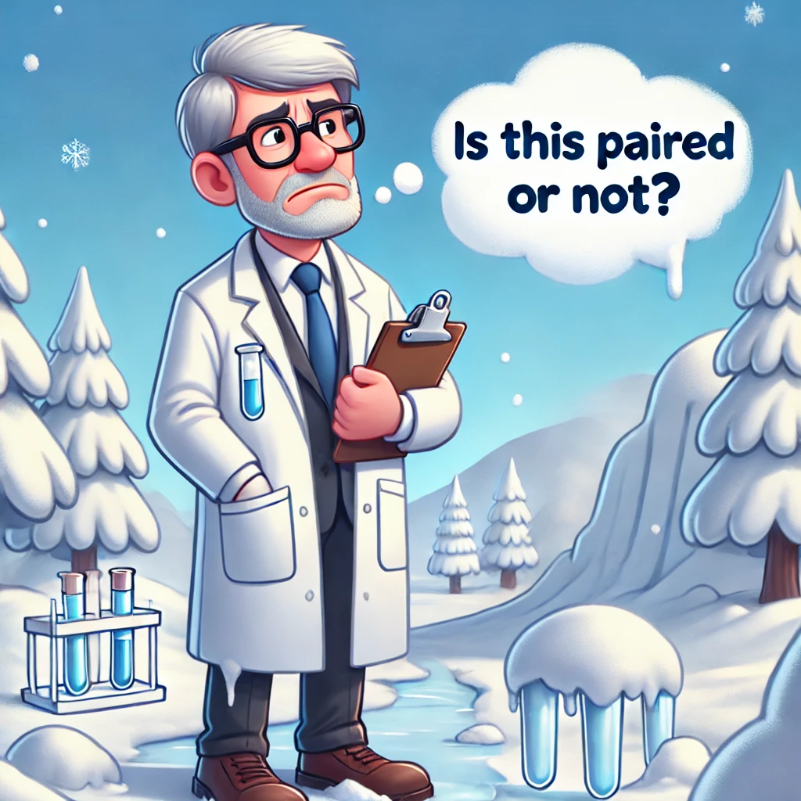

```{r, echo=FALSE, message=FALSE, warning=FALSE}
library(readxl)
library(dplyr)
library(tidyr)
library(readr)
library(lessR)
library(ggplot2)
library(ggpubr)
library(cowplot)
library(patchwork)
library(palmerpenguins)
library(car)
library(ggforce) # for geom_circle
library(RVAideMemoire) #shapiro.test
library(DiagrammeR)
#knitr::opts_chunk$set(dpi= 100)
xaringanExtra::use_panelset()
xaringanExtra::use_scribble()
xaringanExtra::use_search(show_icon = FALSE, position= "bottom-left") # Search
xaringanExtra::use_progress_bar(color = "#0051BA", location = "bottom", 
                                height = "4px")
xaringanExtra::use_clipboard() # Copy Code 
xaringanExtra::use_extra_styles(
  hover_code_line = TRUE,         #<<
  mute_unhighlighted_code = TRUE  #<<
)
xaringanExtra::use_editable(expires = 1) # Add textboxes to edit during presentation
```

# Dependent t-test
- The paired sample t-test, sometimes called the dependent sample t-test, is a statistical procedure used to determine whether the mean difference between two sets of observations is zero.

- In a paired sample t-test, each subject or entity is measured twice, resulting in pairs of observations. 

---
# Dependent t-test

- Used when we have dependent samples - matched, paired or tied somehow:
    1. **Seasonal comparisons of plant growth:** Measuring the height of the same set of plants in two different seasons (e.g., summer and winter).
    2. **Invasive species control:** Comparing the number of native species before and after controlling an invasive species in a forest ecosystem. The samples are matched because they come from the same location before and after intervention.
    3. **Pollution impact on water quality:** Comparing water quality measurements (e.g., levels of pollutants) before and after the implementation of pollution control measures in the same water bodies.
    4. **Before-and-after studies on an ecosystem restoration project:** Measuring biodiversity in a wetland area before and after a restoration effort. The same sites are sampled both times (pre- and post-restoration), so the samples are dependent.

---
# Assumptions
1. **Dependent variable must be continuous:** Data like height, species count, or temperature.
2. **Two groups are paired:** Same sample measured under different conditions (e.g., before and after an intervention).
3. **No significant outliers:** Ensure differences between pairs don't have extreme values.
4. **Differences should be normally distributed:** The differences between pairs should follow a normal distribution.


---
# Function

.pull-left[ 
```{r, eval=F}
t.test(x= , y = ,
       `mu = 0`, 
       paired = , 
       var.equal =, 
       alternative = c("two.sided", "less", "greater")
       )
```
]


.pull-right[ 

- The `mu` argument indicate the true value of difference in means for a two sample test.

]


---
# Function

.pull-left[ 
```{r, eval=F}
t.test(x= , y = ,
       `mu = 0`, 
       paired = , 
       var.equal =, 
       alternative = c("two.sided", "less", "greater")
       )
```
]


.pull-right[ 

- The `mu` argument indicate the true value of difference in means for a two sample test.


- Hypotheses testing for mean difference ( $\mu_d$ ):

  - $H_0: \mu_d = 0$

  - $H_1: \mu_d \neq 0$ (two-tailed)
  - $H_1: \mu_d > 0$ (upper-tailed)
  - $H_1: \mu_d < 0$ (lower-tailed)

]

---
# Example 

---
# Example 

- Background About the Experiment:

- During the winters of 2015 and 2016, scientists simulated ice storms in the Hubbard Brook Experimental Forest in New Hampshire by spraying water onto the forest canopy, creating ice accretion that mimicked natural storm conditions. Some plots received ¼ inch, ½ inch, or ¾ inch of ice, while treatments were repeated in 2017 to study the effects of consecutive storms.

- Task:

- Your task is to determine if live basal area (m²/ha) is significantly greater in control plots compared to ice-treated plots, using data collected one year after the initial treatment.

- Additional Information: <a href="https://hubbardbrook.org/story/the-ice-storm-experiment-at-hubbard-brook/">Link </a>


---
# Import your data

```{r, message=FALSE, warning=FALSE}
ice_before_after <- read_csv("Lecturer Practice/ice_storm_data_before_and_after.csv") 
head(ice_before_after)
```


---
# Run descriptive statistics

```{r, message=FALSE, warning=FALSE}
pivot(ice_before_after, c(IQR, skew, kurtosis, mean, sd, var), Ice)
pivot(ice_before_after, c(IQR, skew, kurtosis, mean, sd, var), Control)
```


---
#  Test for normality 
```{r, message=FALSE, warning=FALSE, highlight.output =5}
shapiro.test(ice_before_after$Control)
shapiro.test(ice_before_after$Ice)
```

---
# Test for equal variance (homogeneity in variances)

.panelset[
.panel[.panel-name[Equal Variance]
```{r, message=FALSE, warning=FALSE, highlight.output =5}
var.test(ice_before_after$Control, ice_before_after$Ice)
```
]

.panel[.panel-name[But]

- But...

- When you run a paired test with `x` and `y`, you're actually running a one-sample test on d=`x`-`y` (e.g., Control vs. Ice). 

- This means that there is only one variable `d`, so it doesn't make sense to talk about var.equal with a paired test.
]
]


---
# Data visualization

.panelset[
.panel[.panel-name[R Code]
```{r plot1, fig.show='hide', fig.width=5.5, fig.height=5.5}
# Convert data to long format for ggplot
ice_before_after_long <- ice_before_after %>%
  pivot_longer(cols = c("Control", "Ice"), 
               names_to = "Condition", 
               values_to = "Value")
ggplot(ice_before_after_long, aes(x = Condition, y = Value, fill = Condition)) +
  geom_boxplot() +
  stat_summary(fun = mean, geom = "point", shape = 20, size = 4, color = "red", fill = "red") + theme_minimal() +
  labs(title = "Comparison of Control and Ice Conditions",
       x = "Condition", y = "Value") +
  scale_fill_manual(values = c("lightblue", "lightgreen"))
```
]

.panel[.panel-name[Plot]
`)
]
]


---
# Data visualization

.panelset[
.panel[.panel-name[R Code]
```{r plot2, fig.show='hide', fig.width=5.5, fig.height=5.5}
# Convert data to long format for ggplot
ice_before_after_long <- ice_before_after %>%
  pivot_longer(cols = c("Control", "Ice"), 
               names_to = "Condition", 
               values_to = "Value") %>%
  mutate(ID = rep(1:(n() / 2), each = 2))  # Adding a unique ID for each pair

# Step 2: Create the paired boxplot with connected points
ggpaired(ice_before_after_long, x = "Condition", y = "Value", 
         id = "ID",                # Using 'ID' to connect paired points
         order = c("Control", "Ice"), 
         line.color = "gray",       # Line color for connections
         line.size = 0.5,           # Line thickness
         boxplot = TRUE) +          # Adding boxplot
  labs(x = "Treatment", y = "live basal area (m²/ha)")
```
]

.panel[.panel-name[Plot]
`)
]
]

---

# Mental check for paired or unpaired

Paired!

<center>

  
  
---

#8. Run the code for the appropriate test

```{r tx-wrangle, highlight.output = 5}
t.test(ice_before_after$Control, ice_before_after$Ice,
alternative = c("greater"),
mu = 0, 
paired = TRUE)
```

---
# Simple plot of differences

- A simple plot of differences between one sample and the other.  Points below the blue line indicate observations where Ice is greater than Control, that is where (Control - Ice) is negative. 

.panelset[
.panel[.panel-name[R Code]
```{r plot3, fig.show='hide', fig.width=5, fig.height=5}
Difference = ice_before_after$Control - ice_before_after$Ice

plot(Difference,
     pch = 16,
     ylab="Difference (Control - Ice)")

abline(0,0, col="blue", lwd=2)
```
]

.panel[.panel-name[Plot]
`)
]
]
---
# Effect size 

```{r}
effectsize::cohens_d(ice_before_after$Control, ice_before_after$Ice,data=ice_before_after)
```
---

# How do I report the result of a dependent t-test?

- t(degrees of freedom) = t-value, p = significance level

- $$t_{(13)} = 1.8109, \, p = 0.04666$$

