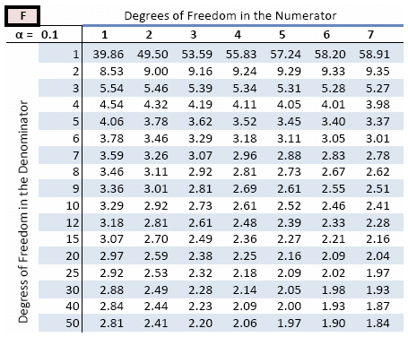

```{r, echo=FALSE, message=FALSE, warning=FALSE}
library(readxl)
library(dplyr)
library(readr)
library(lessR)
library(ggplot2)
library(ggpubr)
library(cowplot)
library(patchwork)
library(palmerpenguins)
library(car)
library(ggforce) # for geom_circle
library(RVAideMemoire) #shapiro.test
library(DiagrammeR)
#knitr::opts_chunk$set(dpi= 100)
xaringanExtra::use_panelset()
xaringanExtra::use_scribble()
xaringanExtra::use_search(show_icon = FALSE, position= "bottom-left") # Search
xaringanExtra::use_progress_bar(color = "#0051BA", location = "bottom", 
                                height = "4px")
xaringanExtra::use_clipboard() # Copy Code 
xaringanExtra::use_extra_styles(
  hover_code_line = TRUE,         #<<
  mute_unhighlighted_code = TRUE  #<<
)
xaringanExtra::use_editable(expires = 1) # Add textboxes to edit during presentation
```


# What is ANOVA
- Analysis of Variance (ANOVA) is a statistical technique, commonly used to studying **differences between two or more group means**. 

- ANOVA test is centered on the different sources of variation in a typical variable.

- This statistical method is an extension of the independent samples t-test for comparing the means in a situation where **there are more than two groups**.

---
# Hypothesis in one-way ANOVA test
.pull-left[
- $H_0$: All group means are equal.

  - $H_0: \mu_1 = \mu_2 = \mu_3 = \dots = \mu_k$
]

.pull-right[ 
- $H_a$: At least, the mean of one group is different

  - $H_A: \mu_i \neq \mu_j \quad \text{for some } i, j$
]

<center>
```{r, echo=FALSE, message=FALSE, warning=FALSE, fig.width=6, fig.height=5}
# Simulate data for three groups
set.seed(123)
data <- data.frame(
  Group = rep(c("Group 1", "Group 2", "Group 3"), each = 30),
  Value = c(rnorm(30, mean = 50, sd = 5),  # Group 1
            rnorm(30, mean = 50, sd = 5),  # Group 2 (same mean as Group 1)
            rnorm(30, mean = 55, sd = 5))  # Group 3 (different mean)
)

# Calculate the means for each group
group_means <- aggregate(Value ~ Group, data, mean)

# Create the density plot with vertical lines at the means
ggplot(data, aes(x = Value, fill = Group)) +
  geom_density(alpha = 0.6) +
  geom_vline(data = group_means, aes(xintercept = Value, color = Group),
             linetype = "dashed", size = 1) +
  theme_minimal() +
  labs(title = "",
       x = "Value", y = "Density") +
  scale_fill_brewer(palette = "Set2") +
  scale_color_brewer(palette = "Set2", guide = "none")
```


---
# When would you run an ANOVA?

- I have a continuous response variable.

- I want to know the difference in that response between more than two groups.

- I have one factor I am testing (One-Way ANOVA).


---
# Decision Flowchart

```{r figure_1, echo = FALSE, fig.align='center'}
DiagrammeR::mermaid("
    graph TD;

        A[What type of data?] --> B[Continuous] 
        A --> Z[Categorical]
        
        B --Research Question--> C[Comparing Differences] 
        B --Research Question--> D[Examining Relationships]
        
        C --How many groups?--> E[1 group] 
        C --How many groups?--> I[2 groups]
        C --How many groups?--> Q[> 2 groups]
        
        E --> F[Normally distributed?] 
        F --Yes--> G[One sample z-test] 
        F --No--> H[Wilcoxon signed rank test]
        
        I --> J[Are Samples Independent?] 
        J --Yes--> K[Normally distributed?] 
        J --No--> L[Normally distributed?]
        
        K --Yes--> M[Independent t-test] 
        K --No--> N[Wilcoxon rank sum test] 
        
        L --Yes--> O[Paired t-test] 
        L --No--> P[Wilcoxon matched pair test]
        
        Q --> R[Use ANOVA] 
        Q --> S[Non-parametric ANOVA]

  style A fill:lightblue,stroke:#333,stroke-width:1px
  style B fill:lightblue,stroke:#333,stroke-width:1px
  style C fill:lightblue,stroke:#333,stroke-width:1px
  style D fill:lightblue,stroke:#333,stroke-width:1px
  style E fill:lightblue,stroke:#333,stroke-width:1px
  style F fill:lightblue,stroke:#333,stroke-width:1px
  style G fill:lightblue,stroke:#333,stroke-width:1px
  style H fill:lightblue,stroke:#333,stroke-width:1px
  style I fill:lightblue,stroke:#333,stroke-width:1px
  style J fill:lightblue,stroke:#333,stroke-width:1px
  style K fill:lightblue,stroke:#333,stroke-width:1px
  style L fill:lightblue,stroke:#333,stroke-width:1px
  style M fill:lightblue,stroke:#333,stroke-width:1px
  style N fill:lightblue,stroke:#333,stroke-width:1px
  style O fill:lightblue,stroke:#333,stroke-width:1px
  style P fill:lightblue,stroke:#333,stroke-width:1px
  style Q fill:lightblue,stroke:#333,stroke-width:1px
  style Z fill:lightblue,stroke:#333,stroke-width:1px

  ", height = '550px', width = '850px'
  )
```


---
# Decision Flowchart: Testing Process

```{r figure_2, echo = FALSE, fig.align='center'}
DiagrammeR::mermaid("
    graph TD;

        A[Independent Samples?] --> B[Test Normality of Residuals]

        B --Normality Assumed--> C[Test Homogeneity of Variances]
        B --Normality Not Assumed--> F[Kruskal-Wallis Test]
        
        C --Equal Variances--> D[ANOVA]
        C --Unequal Variances--> E[Welch Test]

  style A fill:lightblue,stroke:#333,stroke-width:1px
  style B fill:lightblue,stroke:#333,stroke-width:1px
  style C fill:lightblue,stroke:#333,stroke-width:1px
  style D fill:lightblue,stroke:#333,stroke-width:1px
  style E fill:lightblue,stroke:#333,stroke-width:1px
  style F fill:lightblue,stroke:#333,stroke-width:1px
  ", height = '400px', width = '600px')

```

---
# Assumptions
- There are three key assumptions that you need to be aware of: 

  1. All groups are Independent.

  2. The data is normally distributed.

  3. All groups have approximately equal variance.
      * A good rule of thumb: ratio of largest to smallest group stdev must be less than 2:1
      * The ANOVA is less sensitive to this requirement when samples are of equal size from each population.

---
# Assumptions

- A common misconception is that the **response variable** must be normally distributed when conducting an ANOVA. This is **incorrect** because the normality assumptions pertain to the **residuals**, not the response variable.

---
# Assumptions

- A common misconception is that the **response variable** must be normally distributed when conducting an ANOVA. This is **incorrect** because the normality assumptions pertain to the **residuals**, not the response variable.

- The key assumption of ANOVA is that the **residuals** **are independent** and come from a **normal distribution** with mean 0 and variance $\sigma^2$. Specifically:
<center>
$y_{ij} = \mu + \alpha_i + \epsilon_{ij}$
</center>
Where:
- $y_{ij}$ This is the observed value of the response variable for the $j$-th observation in the $i$-th group
- $\mu$ is the overall mean
- $\alpha_i$ is the effect of the $i$-th group
- $\epsilon_{ij} \sim \text{Normal}(0, \sigma^2)$, where $\epsilon_{ij}$ represents the residual error.


---
# Assumptions

<center>
$y_{ij} = \mu + \alpha_i + \epsilon_{ij}$

$\epsilon_{ij} \sim \text{Normal}(0, \sigma^2)$
</center>
- The three key assumptions of ANOVA (normality, homogeneity of variance, and independence) are specifically related to the **residuals** $\epsilon_{ij}$, not the response variable $y_{ij}$.


---
# Assumptions

<center>
$y_{ij} = \mu + \alpha_i + \epsilon_{ij}$

$\epsilon_{ij} \sim \text{Normal}(0, \sigma^2)$
</center>
- The three key assumptions of ANOVA (normality, homogeneity of variance, and independence) are specifically related to the **residuals** $\epsilon_{ij}$, not the response variable $y_{ij}$.

--
    1. The assumption of **normality** dictates that the residuals ( $\epsilon_{ij}$ ) should follow a normal distribution.
    2. The **independence assumption** means that each residual is generated without influence from others, ensuring that knowing one residual provides no information about another.
    3. The **homogeneity of variance assumption** e (sometimes called homoscedasticity) states that the variance (i.e., $\sigma^2$ ) among the groups should be approximately equal, meaning the spread of data points is similar across all groups.

---
# How ANOVA works 

---
# How ANOVA works 
- The ANOVA obtained value (the **F-statistic**) is a ratio of the Between Group Variation divided by the Within Group Variation:      

$$F = \frac{\text{Between-group variance}}{\text{Within-group variance}}$$ 

--
- A large **F** is evidence against $H_0$, since it indicates that there is more difference between groups than within groups.


---
# How ANOVA works 

```{r, echo=FALSE, fig.width=9, fig.height=5}
par(mfrow=c(1,3))
mu <- c(3,4,6)  
k <- length(mu) 
sigma <- .2  
n <- 5 
jitter <- seq(-n,n,length=n)/(3*n) 
data <- NULL  
plot(x=c(0.5, k+.5), y=c(min(mu)-3*sigma, max(mu)+3*sigma),       
	type='n', axes=FALSE, ylab='LAI', xlab='Group',      
	main='Sum of Squares - Within Groups') 
axis(1, at=1:3); axis(2); box() 
for(i in 1:k){      
	temp <- data.frame(Species=i, LAI=rnorm(5, mean=mu[i], sd=sigma))
	points(temp$Species+jitter, temp$LAI, col=i)   
	data <- rbind(data, temp) 
}  
data.means <- data %>% group_by(Species) %>% summarise(Grp.Mean=mean(LAI))
for(i in 1:k){   
	lines(c(i-.5,i+.5), rep(data.means[i,'Grp.Mean'],2), col=i) 
} 
for(i in 1:k){   
	for(j in 1:n){     
		index <- (i-1)*n+j     
		lines(rep(data[index,'Species']+jitter[j],2),
           		c(data.means[i,'Grp.Mean'], data[index, 'LAI']),           
			col=i)   
	} 
}
plot(x=c(0.5, k+.5), y=c(min(mu)-3*sigma, max(mu)+3*sigma),
    type='n', axes=FALSE, ylab='LAI', xlab='Group',      	
	main='Sum of Squares - Between Groups') 
axis(1, at=1:3); axis(2); box() 
total.mean <- mean(data$LAI) 
abline(h=total.mean, lwd=2) 
for(i in 1:k){   
	lines(c(i-.5,i+.5), rep(data.means[i,'Grp.Mean'],2), col=i) 
} 
for(i in 1:k){   
	for(j in 1:n){     
		index <- (i-1)*n+j     
		lines(rep(data[index,'Species']+jitter[j],2),
           		c(data.means[i,'Grp.Mean'], total.mean),           
		col=i)   
	} 
}
plot(x=c(0.5, k+.5), y=c(min(mu)-3*sigma, max(mu)+3*sigma),       
	type='n', axes=FALSE, ylab='LAI', xlab='Group',      
	main='Sum of Squares - Total') 
axis(1, at=1:3); axis(2); box() 
for(i in 1:k){   
	index <- which(data$Species == i)   
	points(data$Species[index]+jitter, data$LAI[index], col=i) 
}  
abline(h=total.mean, lwd=2) 
for(i in 1:k){   
	for(j in 1:n){     
		index <- (i-1)*n+j     
		lines(rep(data[index,'Species']+jitter[j],2),            
			c(total.mean, data[index, 'LAI']),           
			col=i)   
	} 
}
```
---
# Finding the critical value for an F-test

.pull-left[ 
- You will need the critical F table that matches your significance level.

- And you will need to know the degrees of freedom for both the between and within variability.

]

.pull-right[ 

]


---

# One-way ANOVA Summary Table

| Source of<br/> Variation          |   Degrees of<br/> Freedom (DF)   |     Sum of Squares<br/> (SS)     |     Mean Square<br/> (MS)   |        F-value        |
|----------------------------------|:----------------------------------:|:----------------------------------:|:---------------------------:|:---------------------:|
| **Between<br/> Groups**          |          $c - 1$                  |             $SSB$                 |    $MSB = \frac{SSB}{c - 1}$  |       $\frac{MSB}{MSW}$  |
| **Within<br/> Groups**           |          $n - c$                  |             $SSW$                 |    $MSW = \frac{SSW}{n - c}$  |                       |
| **Total**                        |          $n - 1$                  |      $SST = SSB + SSW$            |                           |                       |

- $c$ = number of groups.  
- $n$ = number of observations.


---
# One-way ANOVA Formulas

.pull-left[ 
- The formula for the Sum of Squares Between (SSB) is given by:
$$ SSB = \sum_{j=1}^{C} n_j (\bar{x}_j - \bar{x})^2 $$

Where:
- $C$ = number of groups
- $n_j$ = sample size of group $j$
- $\bar{x}_j$ = mean of group $j$
- $\bar{x}$ = overall mean
]

.pull-right[ ]


---
# One-way ANOVA Formulas

.pull-left[ 
- The formula for the Sum of Squares Between (SSB) is given by:
$$ SSB = \sum_{j=1}^{C} n_j (\bar{x}_j - \bar{x})^2 $$

Where:
- $C$ = number of groups
- $n_j$ = sample size of group $j$
- $\bar{x}_j$ = mean of group $j$
- $\bar{x}$ = overall mean
]

.pull-right[
- The formula for the Sum of Squares Within (SSW) is given by:  

$$SSW = \sum_{j=1}^{C} \sum_{i=1}^{n_j} (\bar{x}_j - \bar{x})^2$$

Where:
- $C$ = number of groups
- $n_j$ = sample size of group $j$
- $\bar{x}_j$ = mean of group $j$
- $\bar{x}$ = overall mean
]


---
# One-way ANOVA Summary Table
- In a study on plant growth with a sample size of **40**, **six different fertilizer** types were tested.

---
# One-way ANOVA Summary Table
- In a study on plant growth with a sample size of **40**, **six different fertilizer** types were tested..

| Source of<br/> Variation          |   Degrees of<br/> Freedom (DF)   |     Sum of Squares<br/> (SS)     |     Mean Square<br/> (MS)   |        F-value        |
|----------------------------------|:----------------------------------:|:----------------------------------:|:---------------------------:|:---------------------:|
| **Between<br/> Groups**          |          $c - 1$                  |             2150                 |    $MSB = \frac{SSB}{c - 1}$  |       $\frac{MSB}{MSW}$  |
| **Within<br/> Groups**           |          $n - c$                  |             5269                 |    $MSW = \frac{SSW}{n - c}$  |                       |
| **Total**                        |          $n - 1$                  |      $SST = SSB + SSW$            |                           |                       |

- $c$ = number of groups.  
- $n$ = number of observations.


---
# One-way ANOVA Summary Table
- In a study on plant growth with a sample size of **40**, **six different fertilizer** types were tested..

| Source of<br/> Variation          |   Degrees of<br/> Freedom (DF)   |     Sum of Squares<br/> (SS)     |     Mean Square<br/> (MS)   |        F-value        |
|----------------------------------|:----------------------------------:|:----------------------------------:|:---------------------------:|:---------------------:|
| **Between<br/> Groups**          |          5                  |             2150                 |    $MSB = \frac{SSB}{c - 1}$  |       $\frac{MSB}{MSW}$  |
| **Within<br/> Groups**           |          $n - c$                  |             5269                 |    $MSW = \frac{SSW}{n - c}$  |                       |
| **Total**                        |          $n - 1$                  |      $SST = SSB + SSW$            |                           |                       |

- $c$ = number of groups.  
- $n$ = number of observations.


---
# One-way ANOVA Summary Table
- In a study on plant growth with a sample size of **40**, **six different fertilizer** types were tested..

| Source of<br/> Variation          |   Degrees of<br/> Freedom (DF)   |     Sum of Squares<br/> (SS)     |     Mean Square<br/> (MS)   |        F-value        |
|----------------------------------|:----------------------------------:|:----------------------------------:|:---------------------------:|:---------------------:|
| **Between<br/> Groups**          |          5                  |             2150                 |    $MSB = \frac{SSB}{c - 1}$  |       $\frac{MSB}{MSW}$  |
| **Within<br/> Groups**           |          34                  |             5269                 |    $MSW = \frac{SSW}{n - c}$  |                       |
| **Total**                        |          $n - 1$                  |      $SST = SSB + SSW$            |                           |                       |

- $c$ = number of groups.  
- $n$ = number of observations.


---
# One-way ANOVA Summary Table
- In a study on plant growth with a sample size of **40**, **six different fertilizer** types were tested..

| Source of<br/> Variation          |   Degrees of<br/> Freedom (DF)   |     Sum of Squares<br/> (SS)     |     Mean Square<br/> (MS)   |        F-value        |
|----------------------------------|:----------------------------------:|:----------------------------------:|:---------------------------:|:---------------------:|
| **Between<br/> Groups**          |          5                  |             2150                 |    $MSB = \frac{SSB}{c - 1}$  |       $\frac{MSB}{MSW}$  |
| **Within<br/> Groups**           |          34                  |             5269                 |    $MSW = \frac{SSW}{n - c}$  |                       |
| **Total**                        |          39                  |      $SST = SSB + SSW$            |                           |                       |

- $c$ = number of groups.  
- $n$ = number of observations.


---
# One-way ANOVA Summary Table
- In a study on plant growth with a sample size of **40**, **six different fertilizer** types were tested.

| Source of<br/> Variation          |   Degrees of<br/> Freedom (DF)   |     Sum of Squares<br/> (SS)     |     Mean Square<br/> (MS)   |        F-value        |
|----------------------------------|:----------------------------------:|:----------------------------------:|:---------------------------:|:---------------------:|
| **Between<br/> Groups**          |          5                        |             2150                 |    $MSB = \frac{SSB}{c - 1}$  |       $\frac{MSB}{MSW}$  |
| **Within<br/> Groups**           |          34                       |             5269                 |    $MSW = \frac{SSW}{n - c}$  |                       |
| **Total**                        |          39                       |             7419                 |                           |                       |

- $c$ = number of groups.  
- $n$ = number of observations.

---
# One-way ANOVA Summary Table
- In a study on plant growth with a sample size of **40**, **six different fertilizer** types were tested.

| Source of<br/> Variation          |   Degrees of<br/> Freedom (DF)   |     Sum of Squares<br/> (SS)     |     Mean Square<br/> (MS)   |        F-value        |
|----------------------------------|:----------------------------------:|:----------------------------------:|:---------------------------:|:---------------------:|
| **Between<br/> Groups**          |          5                        |             2150                 |    430  |       $\frac{MSB}{MSW}$  |
| **Within<br/> Groups**           |          34                       |             5269                 |    $MSW = \frac{SSW}{n - c}$  |                       |
| **Total**                        |          39                       |             7419                 |                           |                       |

- $c$ = number of groups.  
- $n$ = number of observations.


---
# One-way ANOVA Summary Table
- In a study on plant growth with a sample size of **40**, **six different fertilizer** types were tested.

| Source of<br/> Variation          |   Degrees of<br/> Freedom (DF)   |     Sum of Squares<br/> (SS)     |     Mean Square<br/> (MS)   |        F-value        |
|----------------------------------|:----------------------------------:|:----------------------------------:|:---------------------------:|:---------------------:|
| **Between<br/> Groups**          |          5                        |             2150                 |    430  |       $\frac{MSB}{MSW}$  |
| **Within<br/> Groups**           |          34                       |             5269                 |    155  |                       |
| **Total**                        |          39                       |             7419                 |                           |                       |

- $c$ = number of groups.  
- $n$ = number of observations.


---
# One-way ANOVA Summary Table
- In a study on plant growth with a sample size of **40**, **six different fertilizer** types were tested.

| Source of<br/> Variation          |   Degrees of<br/> Freedom (DF)   |     Sum of Squares<br/> (SS)     |     Mean Square<br/> (MS)   |        F-value        |
|----------------------------------|:----------------------------------:|:----------------------------------:|:---------------------------:|:---------------------:|
| **Between<br/> Groups**          |          5                        |             2150                 |    430  |       2.77  |
| **Within<br/> Groups**           |          34                       |             5269                 |    155  |                       |
| **Total**                        |          39                       |             7419                 |                           |                       |

- $c$ = number of groups.  
- $n$ = number of observations.


---
# One-way ANOVA Summary Table
- In a study on plant growth with a sample size of **40**, **six different fertilizer** types were tested.

| Source of<br/> Variation          |   Degrees of<br/> Freedom (DF)   |     Sum of Squares<br/> (SS)     |     Mean Square<br/> (MS)   |        F-value        |
|----------------------------------|:----------------------------------:|:----------------------------------:|:---------------------------:|:---------------------:|
| **Between<br/> Groups**          |          5                        |             2150                 |    430  |       2.77  |
| **Within<br/> Groups**           |          34                       |             5269                 |    155  |                       |
| **Total**                        |          39                       |             7419                 |                           |                       |

- $c$ = number of groups.  
- $n$ = number of observations.
- `p_value <- 1 - pf(f_statistic, df_B, df_W)` = **0.03326991**

---
# Effect Size Measures

---
# Effect Size Measures
- Significant **F ratios** indicate that there is a difference between the treatment groups that cannot be explained by chance alone.
  
- Effect size measures help determine **how big or meaningful** the effect of the treatment is.


---
# Effect Size Measures
- One simple effect size measure:

$$r^2 = \frac{\text{SSB}}{\text{SST}}$$

- where:
      - **SSB** is the sum of squares between groups (variability due to group differences),
      - **SST** is the total sum of squares (total variability in the dataset).

--

- This measure shows how much of the total variability in the data can be explained by the different groupings.   
- **What is meaningful?**  
It depends on how much of the total variability you would expect this grouping to account for.

---
# One-way ANOVA Summary Table
- In a study on plant growth with a sample size of **40**, **six different fertilizer** types were tested.

| Source of<br/> Variation          |   Degrees of<br/> Freedom (DF)   |     Sum of Squares<br/> (SS)     |     Mean Square<br/> (MS)   |        F-value        |
|----------------------------------|:----------------------------------:|:----------------------------------:|:---------------------------:|:---------------------:|
| **Between<br/> Groups**          |          5                        |             2150                 |    430  |       2.77  |
| **Within<br/> Groups**           |          34                       |             5269                 |    155  |                       |
| **Total**                        |          39                       |             7419                 |                           |                       |

- $c$ = number of groups.  
- $n$ = number of observations.
- `p_value <- 1 - pf(f_statistic, df_B, df_W)` = **0.03326991**
-  $r^2 = \frac{SSB}{SST}  =  \frac{2150}{7419}$ = **0.2897**


---
# Example
```{r, echo=FALSE, message=FALSE, warning=FALSE}
# https://www.scribbr.com/statistics/anova-in-r/
```

---
# Example
```{r}
crop <- read.csv('Lecturer Practice/crop.csv')
head(crop)
```

---
# Data visualization
- Visualize the data distribution using boxplots and jitter for individual points:

.panelset[
.panel[.panel-name[R Code]
```{r plot1, fig.show='hide', fig.width=5.5, fig.height=5.5}
ggplot(crop) +
  aes(x = fertilizer, y = yield, fill = fertilizer) +
  geom_boxplot() +
    geom_jitter(shape = 15,
        color = "steelblue",
        position = position_jitter(0.21)) +
   theme_minimal()

```
]

.panel[.panel-name[Plot]
`)
]
]

---
# Running the ANOVA
- Run one-way ANOVA to assess differences between fertilizer groups:
```{r highlight.output = 2}
one.way <- aov(yield ~ fertilizer, 
               data = crop, var.equal = TRUE )

summary(one.way)
```

---
# Calculating $R^2$ in One-Way ANOVA

```{r highlight.output = 1}
# Get the ANOVA summary
anova_summary <- summary(one.way)

# Extract Sum of Squares from the summary output
ss_between <- anova_summary[[1]][["Sum Sq"]][1]  # Between-groups SS (Fertilizer)
ss_total <- sum(anova_summary[[1]][["Sum Sq"]])  # Total SS (Between + Residual)

# Compute R-squared
r_squared <- ss_between / ss_total
print(r_squared)

```


---
# Checking Assumptions

---
# Checking Assumptions
- ANOVA assumes that **residuals** are **normally distributed** and that the **variance across groups is homogeneous (equal variances)**.


---
# Checking Assumptions
- ANOVA assumes that **residuals** are **normally distributed** and that the **variance across groups is homogeneous (equal variances)**.

- The **normality of residuals** can be tested using the **Shapiro-Wilk test**.

- The **homogeneity of variances** can be checked using **Bartlett's test** or **Levene's test**.

- Additionally, diagnostic plots like **Q-Q plots (for normality)** and **Residuals vs. Fitted plots (for homogeneity)** can provide visual confirmation.

---
# Checking Assumptions: Normality
- Check normality of residuals using a QQ plot and the Shapiro-Wilk test.

.pull-left[
```{r, fig.width=4.5, fig.height=4.5}
plot(one.way, 2) 
```
]

.pull-right[
]


---
# Checking Assumptions: Normality
- Check normality of residuals using a QQ plot and the Shapiro-Wilk test.

.pull-left[
```{r, fig.width=4.5, fig.height=4.5}
plot(one.way, 2) 
```
]

.pull-right[
- Compute Shapiro-Wilk test of normality
```{r highlight.output = 5}
shapiro.test(residuals(one.way))
```
]

---
# Assumption Check: Interpretation 
- **QQ plot:** As the points fall approximately along the reference line, we **assume normality**.

- **Shapiro-Wilk test:** The p-value (p = 0.7594) is not significant, supporting the **assumption of normality**.

---
# Check Assumptions: Homogeneity of Variances

---
# Check Assumptions: Homogeneity of Variances
- The Residuals vs. Fits plot helps check for homogeneity of variances.

.pull-left[
```{r, fig.width=4.5, fig.height=4.5}
plot(one.way, 1) 
```
]

.pull-right[
In the plot above, there's no clear pattern between residuals and fitted values (the group means), which indicates **homogeneity of variances**.
]


---
# Check Assumptions: Homogeneity of Variances
.pull-left[
The homogeneity of variances can also be checked using **Bartlett's** or Levene's tests.
]

.pull-right[
```{r highlight.output = 5}
bartlett.test(yield ~ fertilizer, data=crop)
```

]


---
# Check Assumptions: Homogeneity of Variances
.pull-left[
The homogeneity of variances can also be checked using Bartlett's or **Levene's tests**.
]

.pull-right[
```{r highlight.output = 3}
leveneTest(yield ~ fertilizer, data=crop)
```

]

---
# Assumption Check: Interpretation 
- The p-value is not less than the significance level of 0.05, as seen in the output above. This indicates that **there is no indication that the variance across groups is statistically significant**.

- As a result, we can infer that the **variations in the different treatment groups are homogeneous**.

---
# Post-hoc test

---
# Post-hoc test

## Why Perform a Post-hoc Test?

- When the **overall p-value** from the ANOVA is below the significance level (typically p < 0.05), it suggests that **at least one group mean is different from the others**.

- However, ANOVA does not specify which groups are different; it only tells us that **not all group means are equal**.

- To pinpoint which groups differ, we need to conduct a **post-hoc test**. This test controls for the family-wise error rate, ensuring accurate comparisons between group means.

---
# Post-hoc test

## Why Perform a Post-hoc Test?

- Two of the most commonly used post-hoc tests include: 

.pull-left[
- **The Tukey Method:**  
The Tukey post-hoc test should be used when you would like to make pairwise comparisons between group means when the sample sizes for each group are equal.]
.pull-right[
- **The Bonferroni Method:**  
The Bonferroni post-hoc test should be used when you have a set of planned comparisons you would like to make beforehand.
]


---
# Post-hoc test

- Since there are 3 groups (fertilizers), we will make these pairwise comparisons:

  - Group 1 vs. Group 2
  - Group 1 vs. Group 3
  - Group 2 vs. Group 3
  
---
# Running the Post-hoc Test

- We use the Tukey Honest Significant Difference (Tukey HSD) test to compare all possible pairs of groups: 

```{r, highlight.output = 8:10}
post_test <- TukeyHSD(one.way)
post_test 
```

---
# Visualizing the Post-hoc Test

- The plot below visualizes the results of the Tukey HSD test:

```{r fig.width=4.5, fig.height=4.5}
plot(post_test)
```

---
# How to summarize results

<span style="color:#00796B;">- State the original research question / hypothesis.</span>   
<span style="color:#E65100;">- Briefly describe the methods including the type of test run: One-way ANOVA, if significant type of Means Comparison (e.g. Tukey's HSD Means Comparison).</span>  
<span style="color:#1E88E5;">- Describe your results including: Shorthand: $F_{(df_1, df_2)} = , p-value , r^2 =$. Results of any means comparison (which groups are larger than which other groups? Which are the same?).</span>    
<span style="color:#424242;">- Interpret significance and effect size ( $r^2$ ), big picture: what does this mean in terms of your original research question?</span>

